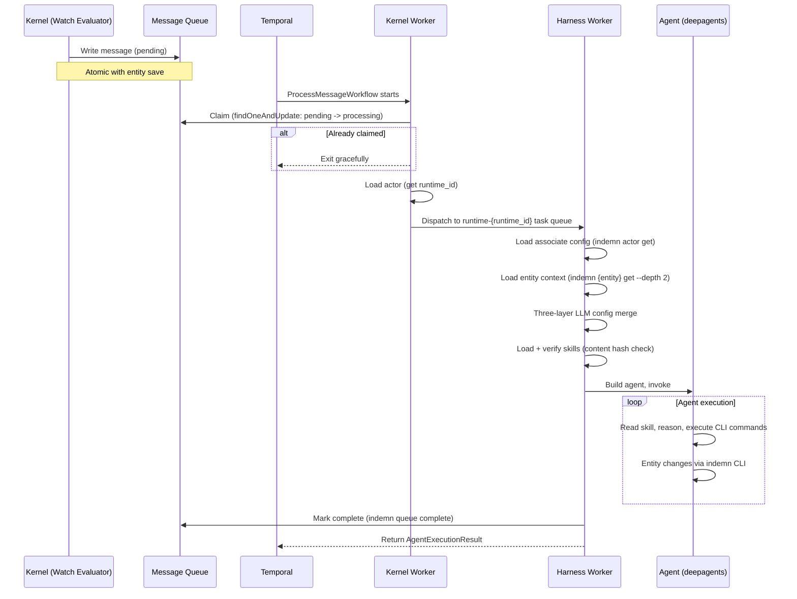
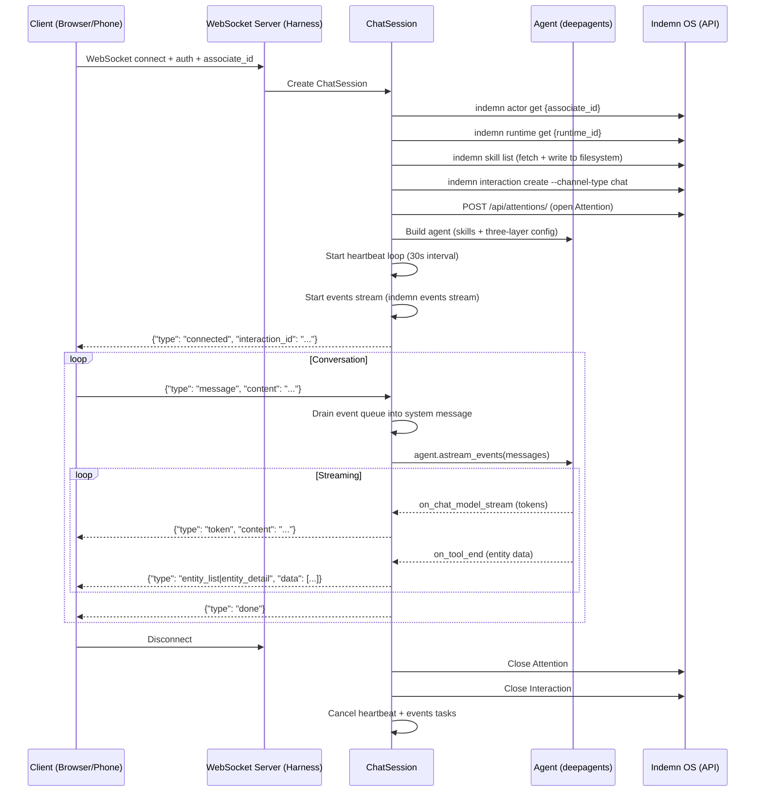

# Associates: AI Actors, Skills, Harnesses, and Execution

This document covers the full lifecycle of AI participation in the OS — from the actor model that makes AI possible, through the skill system that governs behavior, to the harness infrastructure that runs associates in production.

---

## The Actor Model

An **actor** is a participant in the system. The kernel draws no distinction between a human employee and an AI associate. Both authenticate, both hold roles, both see the same message queue, both execute the same CLI operations.

Every actor has:

- **Identity** — name, email, type (`human`, `associate`, `tier3_developer`)
- **One or more roles** — determining what they can access (permissions) and what flows to them (watches)
- **A state machine** — `provisioned` -> `active` -> `suspended` / `deprovisioned`

The actor's work queue is the **union of messages** matching all their roles' watches. A human with three roles sees messages from all three. An associate with one role sees messages from that one. The queue is the same regardless of who is consuming it.

This is not a metaphor. When you run `indemn actor list`, humans and associates appear in the same list. When a message targets a role, every actor in that role — human or AI — can claim it. The OS is structurally indifferent to who does the work.

**Source**: `kernel_entities/actor.py` — the `Actor` entity definition.

---

## The Actor Spectrum

Associates exist on a spectrum of three execution modes:

| Mode | Behavior | When to Use |
|------|----------|-------------|
| **deterministic** | Fixed procedure. Rules, lookups, `--auto` only. No LLM. | High-volume commodity tasks where patterns are known |
| **reasoning** | LLM reads skill, analyzes situation, decides actions. | Complex work requiring judgment |
| **hybrid** | Tries deterministic path first. LLM fallback when `--auto` returns `needs_reasoning`. | Default for most associates — cheap for routine, smart for edge cases |

The OS does not care which mode an actor operates in. It sees the same thing regardless: a trigger arrives, CLI commands execute, entities change, messages are generated. What happens between the trigger and the commands — whether a human thought about it, an LLM reasoned about it, or a script ran through it — is the actor's business.

The `strict_deterministic` flag on an associate controls fallback behavior. When `true`, a `needs_reasoning` result raises an error instead of falling back to the LLM — useful for audit-critical paths where you need guarantee that no AI judgment was applied.

---

## Associate Definition

Creating an associate is a four-step process:

```bash
# 1. Create a skill (behavioral instructions)
indemn skill create --name email-classifier \
  --content-from-file skills/email-classifier.md

# 2. Create a Runtime (or use an existing one)
indemn runtime create --name async-dev \
  --kind async_worker --framework deepagents

# 3. Create the associate actor
indemn actor create --type associate --name "Email Classifier" \
  --mode hybrid --role email_classifier \
  --skills '["email-classifier"]'

# 4. Activate
indemn actor transition <actor_id> --to active
```

The associate is now live. Messages matching its role's watches will flow to its queue. The harness running on the associate's Runtime picks up the work.

**Associate-specific fields** on the Actor entity (all `None` for humans):

| Field | Type | Purpose |
|-------|------|---------|
| `skills` | `list[str]` | Skill names loaded at execution time |
| `mode` | `deterministic` / `reasoning` / `hybrid` | Execution mode |
| `runtime_id` | `ObjectId` | Which Runtime hosts this associate |
| `owner_actor_id` | `ObjectId` | Human owner for credential delegation |
| `llm_config` | `dict` | Per-associate LLM overrides (model, temperature) |
| `trigger_schedule` | `str` | Cron expression for scheduled execution |
| `strict_deterministic` | `bool` | Raise on `needs_reasoning` instead of LLM fallback |

**Source**: `kernel_entities/actor.py`, `indemn_os/src/indemn_os/actor_commands.py`

---

## Role Creation — Two Paths

Roles are the mechanism that connects actors to work. Every role carries **permissions** (what entity types the actor can read/write) and **watches** (what entity changes generate messages for the actor).

There are two ergonomic paths to create a role:

### Named Shared Role

An organizational job function — reusable, grantable, visible as a named concept.

```bash
indemn role create --name underwriter \
  --permissions '{"read": ["Submission", "Policy"], "write": ["Submission"]}' \
  --watches '[{"entity_type": "Submission", "event": "created"}]'

# Grant to any actor
indemn actor add-role jc@indemn.ai --role underwriter
```

### Inline Role on Associate

Created implicitly when you define an associate with permissions and watches directly. The kernel creates a singleton role bound to that associate — not listed as a named role, not grantable to others.

```bash
indemn actor create --type associate --name "Email Classifier" \
  --permissions '{"read": ["Email"], "write": ["Email"]}' \
  --watches '[{"entity_type": "Email", "event": "created"}]' \
  --skills '["email-classifier"]'
```

Both are the same `Role` primitive underneath. The inline role has `is_inline: true` and `bound_actor_id` set.

**Source**: `kernel_entities/role.py` — `Role` entity with `WatchDefinition`, `is_inline`, and `bound_actor_id` fields.

---

## Skills

Skills are markdown documents. Always.

### Two Kinds

**Entity skills** are auto-generated from entity definitions. They document what CLI commands exist, what fields an entity has, what states it can be in, what operations are available. They are reference material — the associate reads them to know *how* to use the system.

**Associate skills** are written by humans or AI. They are behavioral instructions — *when* to classify, *when* to link, *when* to escalate, *when* to use `--auto` and what to do when it returns `needs_reasoning`. The skill is the program. The associate's execution mode is the interpreter.

### Storage and Versioning

Skills are stored in MongoDB, versioned through the changes collection, and updatable through the CLI:

```bash
# Create
indemn skill create --name email-classifier \
  --content-from-file skills/email-classifier.md

# Read
indemn skill get email-classifier

# Update (new version, takes effect immediately)
indemn skill update email-classifier \
  --content-from-file skills/email-classifier-v2.md

# List all
indemn skill list
```

Every update is recorded in the changes collection with before/after content, timestamp, and actor attribution.

### Tamper Detection

Skills are tamper-evident. A SHA-256 content hash is computed on creation and stored alongside the skill. On every load — including when a harness fetches skills for an associate — the hash is verified. A skill modified outside the normal update path (direct database edit) is rejected.

```python
# kernel/skill/integrity.py
def compute_content_hash(content: str) -> str:
    return hashlib.sha256(content.encode()).hexdigest()

def verify_content_hash(content: str, expected_hash: str) -> bool:
    return compute_content_hash(content) == expected_hash
```

**Source**: `kernel/skill/integrity.py`, `kernel/skill/generator.py`

---

## The Harness Pattern

A harness is deployable glue code that bridges a specific agent framework and transport to the OS. Each harness is thin — roughly 60 lines of orchestration — because the framework handles agent execution and the OS handles everything else.

### Container Images

Each `kind` + `framework` combination produces one container image:

| Image | Kind | Framework | Transport |
|-------|------|-----------|-----------|
| `indemn/runtime-async-deepagents` | async_worker | deepagents | Temporal task queue |
| `indemn/runtime-chat-deepagents` | realtime_chat | deepagents | WebSocket |
| `indemn/runtime-voice-deepagents` | realtime_voice | deepagents | LiveKit (planned) |

One image serves many associates. The image is generic per `kind` + `framework`. The associate-specific behavior comes from the skills loaded at execution time.

### Why CLI, Not SDK

Harnesses use CLI subprocess calls for **all** OS operations — no direct kernel imports:

```python
# harnesses/_base/harness_common/cli.py
def indemn(*args: str, timeout: float = 30.0, parse_json: bool = True) -> Any:
    cmd = ["indemn", *args]
    result = subprocess.run(cmd, env=env, capture_output=True, timeout=timeout)
    return json.loads(result.stdout.decode()) if parse_json else result.stdout.decode()
```

Five reasons:

1. **Consistency** — associates already use CLI via `execute()` in their agent loop. The harness uses the same interface.
2. **Universality** — any language can subprocess to the CLI. Harnesses are not Python-locked.
3. **Auditability** — every CLI call is traced. Every operation is visible in the observability backend.
4. **Permission scoping** — CLI calls authenticate with the service token. The OS enforces the actor's role permissions on every request.
5. **Debuggability** — any CLI command the harness runs can be manually reproduced by a developer.

The harness has **two CLI surfaces**: harness orchestration (load config, register instance, heartbeat, mark complete) uses `harness_common.cli.indemn()`. The agent's own tool execution goes through the framework's backend (deepagents' `LocalShellBackend` or `DaytonaSandbox`), which also invokes `indemn` as a subprocess but with the agent's own context.

**Source**: `harnesses/_base/harness_common/cli.py`, `harnesses/_base/harness_common/backend.py`

### Shared Harness Library

All harnesses share a common library (`harnesses/_base/harness_common/`) with five modules:

| Module | Purpose |
|--------|---------|
| `cli.py` | Subprocess wrapper for `indemn` CLI calls |
| `runtime.py` | Instance registration + heartbeat loop |
| `interaction.py` | Interaction entity lifecycle (create, close, transfer) |
| `attention.py` | Attention entity lifecycle (open, close, heartbeat) |
| `backend.py` | Sandbox backend factory (LocalShell or Daytona) |

---

## Execution Lifecycle — Async

Async associates process work from the message queue via Temporal durable workflows.



### Step by Step

1. **Message arrives** — entity save triggers watch evaluation. Matching watches write messages to the queue atomically with the entity save.

2. **Temporal dispatches** — `ProcessMessageWorkflow` starts on the `indemn-kernel` task queue. The kernel worker claims the message with `findOneAndUpdate` (status: `pending` -> `processing`). If already claimed, exit gracefully.

3. **Route to harness** — the workflow loads the associate's actor to find its `runtime_id`, then dispatches the `process_with_associate` activity to `runtime-{runtime_id}` task queue. The harness worker on that Runtime picks it up.

4. **Load context** — the harness loads the associate config (`indemn actor get`), entity context with related entities (`indemn {entity} get --depth 2`), Runtime config, and optional Deployment config.

5. **Merge config** — three-layer LLM config merge: Runtime defaults -> Associate override -> Deployment override.

6. **Load skills** — each skill is fetched via `indemn skill get`. Content hash is verified on load.

7. **Execute** — the agent runs. Skills provide instructions. CLI commands execute via the framework backend. Entity changes happen through `indemn` CLI calls, each authenticated and traced.

8. **Complete** — the harness marks the message complete (`indemn queue complete`). The message moves from the hot queue to the cold message log.

### Failure Handling

- **Already claimed** — workflow exits gracefully. No duplicate processing.
- **Crash mid-processing** — Temporal replays from the last checkpoint. The visibility timeout on the message expires, returning it to `pending` for re-claim.
- **Skill verification fails** — `SkillTamperError` is non-retryable. Message fails permanently.
- **Agent error** — harness calls `indemn queue fail --reason "..."`. Message marked failed.
- **Heartbeat timeout** — Temporal cancels the activity after 2 minutes of no heartbeat. Message returns to queue.

**Source**: `kernel/temporal/workflows.py` (`ProcessMessageWorkflow`), `harnesses/async-deepagents/main.py` (`process_with_associate` activity), `kernel/queue_processor.py` (sweep backstop)

---

## Execution Lifecycle — Real-Time (Chat/Voice)

Real-time associates handle ongoing conversations over WebSocket or voice connections. The lifecycle is session-based, not message-based.



### Step by Step

1. **Connection** — client opens WebSocket to `/ws/chat` with auth token and `associate_id`.

2. **Load config** — session loads the associate actor, Runtime, and optional Deployment via CLI. Skills are fetched and written to the container filesystem as `SKILL.md` files for deepagents' progressive disclosure (metadata in prompt, full content loaded on demand via `read_file`).

3. **Create Interaction** — an Interaction entity is created via `indemn interaction create --channel-type chat --associate {id}`. This is the conversation container.

4. **Open Attention** — an Attention record is created: "this associate is currently attending to this Interaction, with purpose `real_time_session`." Heartbeat-maintained with 2-minute TTL.

5. **Build agent** — deepagents agent constructed with three-layer merged LLM config, skills directory, and optional checkpointer for conversation persistence.

6. **Start background tasks** — heartbeat loop (30s interval keeps Attention alive) and events stream (`indemn events stream` subprocess for mid-conversation entity awareness).

7. **Message loop** — each user message is processed through the agent. Response tokens stream back to the client in real-time. Tool results are classified as entity data (rendered as cards/tables in the UI) or text.

8. **Mid-conversation events** — entity changes relevant to the associate's scope are delivered via the events stream subprocess. Queued events are drained into a system message on the next user turn, giving the agent awareness of changes that happened while it was idle.

9. **Cleanup** — on disconnect: cancel heartbeat, terminate events process, close Attention, close Interaction.

**Source**: `harnesses/chat-deepagents/main.py`, `harnesses/chat-deepagents/session.py`, `harnesses/chat-deepagents/agent.py`

---

## The Runtime Entity

A Runtime is a deployable host for associate execution. It describes the execution environment — one Runtime hosts many associates.

```python
class Runtime(BaseEntity):
    name: str
    kind: Literal["realtime_chat", "realtime_voice", "realtime_sms", "async_worker"]
    framework: str            # deepagents, langchain, custom
    framework_version: str
    transport: Optional[str]  # websocket, livekit, twilio_sms
    transport_config: dict
    llm_config: dict          # Default LLM settings for all associates on this Runtime
    sandbox_config: dict
    deployment_image: str     # Container image reference
    deployment_platform: str  # railway, ecs, etc.
    deployment_ref: Optional[str]
    capacity: dict            # {"max_concurrent_sessions": int, "max_memory_mb": int}
    status: Literal["configured", "deploying", "active", "draining", "stopped", "error"]
    instances: list[dict]     # [{instance_id, registered_at, last_heartbeat}]
```

### State Machine

```
configured --> deploying --> active --> draining --> stopped
                  |            |                       ^
                  v            v                       |
                error -----> configured/stopped -------+
```

- `configured` -> `deploying`: deployment initiated
- `deploying` -> `active`: first instance registers
- `active` -> `draining`: graceful shutdown initiated (stops accepting new work)
- `draining` -> `stopped`: all in-flight work complete
- `error` -> `configured`/`stopped`: recovery or retirement

### Relationship to Associates

The associate carries `runtime_id` pointing to its Runtime. One Runtime hosts many associates. The associate provides per-session configuration (skills, model, mode). The Runtime provides the execution environment (framework, transport, capacity, sandbox).

**Source**: `kernel_entities/runtime.py`

---

## Instance Bootstrap Sequence

When a harness container starts, it follows this sequence:

```
1. Read RUNTIME_ID from environment variable
2. Auth with OS via INDEMN_SERVICE_TOKEN
3. indemn runtime register-instance --runtime-id <RUNTIME_ID>
   -> Adds instance to Runtime.instances list
   -> Transitions Runtime deploying -> active (if first instance)
4. Start work consumers:
   - Async: Temporal worker on queue "runtime-{RUNTIME_ID}"
   - Chat: WebSocket server on /ws/chat
   - Voice: LiveKit Agent worker (planned)
5. Start periodic heartbeat loop:
   - indemn runtime heartbeat --runtime-id <RUNTIME_ID> (30s interval)
   - 10 consecutive failures -> process exit
6. On shutdown: process terminates, heartbeat stops, TTL expiration handles cleanup
```

The heartbeat loop is fault-tolerant. It counts consecutive failures and exits the process after 10 — the container orchestrator (Railway, ECS) restarts it, and the new instance re-registers.

**Source**: `harnesses/_base/harness_common/runtime.py`

---

## Three-Layer Config Model

Customer-facing behavior is configured across three layers, merged at session start:

```python
def _merge_llm_config(runtime: dict, associate: dict, deployment: dict | None) -> dict:
    return {
        **(runtime.get("llm_config") or {}),        # Layer 1: Runtime defaults
        **(associate.get("llm_config") or {}),       # Layer 2: Associate override
        **((deployment.get("llm_override") or {}) if deployment else {}),  # Layer 3: Deployment
    }
```

| Layer | Entity | Controls | Example |
|-------|--------|----------|---------|
| **Runtime** | Runtime entity | Execution environment — default model, framework version, capacity | `{"model": "anthropic:claude-sonnet-4-6", "temperature": 0.7}` |
| **Associate** | Actor entity | Conversation style — what the agent says, tools it uses, per-agent model override | `{"model": "google_vertexai:gemini-3-flash-preview"}` |
| **Deployment** | Deployment entity | Per-venue config — SurfaceConfig (vendor + visual), greeting, per-deployment LLM override, parameter contract, auth identity (acts_as) | `{"temperature": 0.3}` |

Shallow merge, last-writer-wins. The Deployment layer is optional — absent for async associates that don't have a Deployment record, present for any Deployment-bound execution (real-time chat/voice always; async by future direction).

> **See [`deployments.md`](deployments.md) for the full Deployment design**: fields, state machine, parameter contract (parameter_schema + static_parameters), the `acts_as` security model, SurfaceConfig + BrandAssets, the embed.js SDK pattern, and resumability.

---

## Skill Loading and the `<skill>` SystemMessage

The harness pre-fetches the associate's skill content at session/invocation start and prepends it as a SystemMessage to the agent's message context. This is the canonical pattern across all three harnesses (async, chat, voice). The agent's `system_prompt` (set at agent build time) contains the framework-level behavioral instructions and tells the agent to "Read your `<skill>` SystemMessage — it defines your procedure."

Why this pattern:
- **Latency.** Loading the skill via CLI on turn 1 of a real-time session adds ~300-500ms (one subprocess + one LLM round-trip). Pre-fetching at session start eliminates that.
- **Semantic correctness.** A skill is a behavioral instruction TO the agent. SystemMessage is its rightful home (vs HumanMessage, which is the user's content).
- **Caching.** The pre-formed SystemMessage is cacheable across turns (Anthropic prompt caching, OpenAI similar). Re-prepending on every turn would defeat the cache.
- **Persistence via checkpointer.** The SystemMessage is part of the initial conversation state at session start; the MongoDB checkpointer preserves it across turns. Subsequent invocations within the same session see it without re-prepending.

The `<skill>` SystemMessage is composed once at session start:

```python
# In harness session.py (or main.py for async)
skill_content = indemn("skill", "get", associate.skills[0])  # CLI pre-fetch
system_msg = SystemMessage(content=f"<skill>\n{skill_content}\n</skill>")
agent_input_messages = [system_msg, *conversation_history]
```

For real-time channels (chat, voice), a second SystemMessage is also composed: `<deployment_context>` carrying the merged static_parameters + dynamic_params (see [`deployments.md`](deployments.md) § Parameter Contract).

### Checkpointer Per Channel

Real-time channels use LangGraph's MongoDB checkpointer keyed by `interaction_id` — state accumulates across turns within one session, persists across reconnects.

Async also uses MongoDB checkpointer post-convergence, keyed by `message_id` — per-invocation isolation in cascades (the synthesizer doesn't see the classifier's history), but durable per-invocation so human-in-the-loop pause/resume works.

See [`observability.md`](observability.md) § Identifier Semantics for the full `thread_id` rule (LangSmith uses correlation_id as thread_id; LangGraph checkpointer uses interaction_id or message_id depending on the work shape).

---

## The `owner_actor_id` Pattern

Associates can act on behalf of a human. This enables personal sync associates, the default UI assistant, and any pattern where AI acts using a human's credentials.

### How It Works

The actor entity has an optional `owner_actor_id` field:

```bash
indemn actor create --type associate --name "Craig's Assistant" \
  --mode reasoning --role default_assistant \
  --owner-actor craig@indemn.ai \
  --skills '["ui-assistant"]'
```

### Credential Resolution Chain

When an associate needs an external system connection, the integration resolver follows a three-step priority chain:

1. **Associate's own integrations** — does the associate have a personal integration of this type?
2. **Owner's personal integrations** — if the associate has an `owner_actor_id`, check the owner's personal integrations
3. **Org-level integrations** — shared organizational integrations accessible via the actor's roles

```python
# kernel/integration/resolver.py
async def resolve_integration(system_type, actor_id, org_id):
    # Step 1: Actor's own
    personal = await Integration.find_one({...actor_id, system_type, status: "active"})
    if personal: return personal

    # Step 2: Owner's (for owner-bound associates)
    actor = await Actor.get(actor_id)
    if actor.owner_actor_id:
        owner_integration = await Integration.find_one({...owner_actor_id, system_type})
        if owner_integration: return owner_integration

    # Step 3: Org-level with role check
    org_integration = await Integration.find_one({owner_type: "org", roles match})
    if org_integration: return org_integration

    raise AdapterNotFoundError(...)
```

### Constraints

- **Owner must consent** on associate creation. The `--owner-actor` flag resolves the email to an actor ID and records the binding.
- **Revocation is immediate.** Remove the `owner_actor_id` and the associate loses access to the owner's integrations on the next credential resolution.
- **Audit records** track every use: "associate X used owner Y's integration Z at time T."

**Source**: `kernel/integration/resolver.py`, `kernel_entities/actor.py`

---

## Handoff

Transfer between actors on a live interaction — human to AI, AI to human, or AI to AI.

### Transfer Commands

```bash
# Transfer to a specific actor
indemn interaction transfer <id> --to-actor craig@indemn.ai

# Transfer to a role queue (next available actor in that role claims it)
indemn interaction transfer <id> --to-role senior_csr
```

### How It Works

Transfer is a field update on the Interaction entity — `handling_actor_id` changes. The runtime detects this change via the events stream and switches modes:

- **AI -> Human**: the associate's events stream sees the `handling_actor_id` change. The agent stops processing. Turns are now bridged through the queue for the human.
- **Human -> AI**: the human clicks "hand back to AI" in the UI. The associate's harness picks up the interaction with a new Attention record.

### Three Human States

A human's relationship to a live interaction has three states:

| State | Attention Purpose | What Happens |
|-------|------------------|--------------|
| **Not involved** | No Attention | Human does not see the interaction |
| **Observing** | `observing` | Human sees the conversation in real-time, can read but not send |
| **Handling** | `real_time_session` or via queue | Human is the active handler — their messages go to the customer |

Observation is first-class. A human can watch a live AI conversation, read the turns, and decide to take over only when needed.

**Source**: `harnesses/_base/harness_common/interaction.py` (`transfer_interaction`)

---

## Gradual Rollout Pattern

The unified queue makes it possible to introduce AI gradually into any role:

```
Week 1: Human only
  indemn actor add-role jc@indemn.ai --role classifier
  # JC sees all classification work in their queue

Week 2: Human + AI side by side
  indemn actor create --type associate --name "Classifier" \
    --role classifier --mode hybrid --skills '["email-classifier"]'
  # Both JC and the associate see the same queue
  # Associate claims what it can. JC handles the rest.

Week 3: AI primary, human removed
  indemn actor remove-role jc@indemn.ai --role classifier
  # Associate handles all classification work

Week 4: AI primary with escalation
  # Associate marks needs_review on difficult cases
  # A new watch on a human role catches needs_review
  # Human only sees cases the AI flagged
```

The infrastructure never changes between these four states. The same message queue, the same claiming mechanism, the same entity operations. Only the role assignments change.

---

## Design Decisions

### Why Generic Temporal Workflow (Not Skill-Specific)

`ProcessMessageWorkflow` is the same for every associate, regardless of what it does. The skill IS the source of truth for behavior — it tells the agent what to do. Temporal is purely a durable execution wrapper: claim, dispatch, handle failure, retry. The workflow doesn't need to know what the agent does any more than a cron scheduler needs to know what the script does.

### Why CLI Not SDK for Harnesses

The harness runs outside the kernel trust boundary — in a separate container, on a separate host. It cannot import kernel code. The CLI is the only interface it has, and this is deliberate:

- Same interface the agent uses (consistency)
- Every operation is authenticated and traced (auditability)
- Role permissions are enforced on every request (security)
- A developer can reproduce any harness operation manually (debuggability)

### Why Unified Queue

Associates are employees. They see the same work, through the same mechanism. This makes them interchangeable with humans — you can add an associate to a role, remove a human from a role, or have both working the same queue. No special routing logic, no separate AI pipeline.

### Why Harness Pattern (Not Kernel Code)

Harnesses are deployment infrastructure, not kernel logic. The kernel knows about entities, messages, roles, and actors. It does not know about deepagents, WebSockets, Temporal workers, or LLM providers. Harnesses bridge that gap — they translate between the agent framework's world and the OS's world via the CLI.

This keeps the kernel focused on its job (the six primitives and their mechanisms) and lets harnesses evolve independently (new frameworks, new transports, new sandbox providers).

### Why Harness Common Library

The `harness_common` package exists because all harnesses share the same lifecycle operations — register instance, heartbeat, create interaction, open attention, resolve backend. The framework-specific code (how to build an agent, how to stream responses) lives in the individual harness. The OS lifecycle code lives in the shared library.
