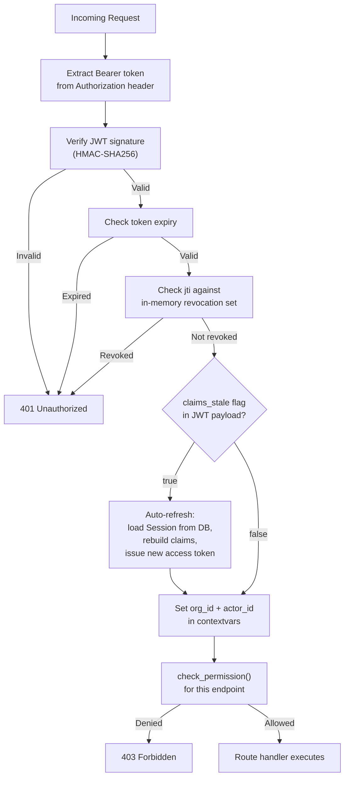

# Authentication & Session Management

This document describes the authentication architecture of the Indemn OS -- how identity is verified, how sessions are managed, how permissions propagate through active sessions, and how platform administrators access customer organizations. A senior developer who has never seen this system should understand every auth flow after reading this document.

---

## Session as 7th Kernel Entity

Session is a first-class kernel entity, not a side effect of login. It has its own lifecycle, state machine, and change tracking via `save_tracked()` like every other kernel entity.

| Field | Type | Description |
|-------|------|-------------|
| `actor_id` | ObjectId | The authenticated identity |
| `org_id` | ObjectId | Organization scope for this session |
| `type` | enum | `user_interactive`, `associate_service`, `tier3_api`, `cli_automation` |
| `auth_method_used` | enum | `password`, `totp`, `sso`, `token`, `magic_link` |
| `status` | enum | `active`, `expired`, `revoked` |
| `refresh_token_ref` | string | Reference to hashed refresh token (never the token itself) |
| `access_token_jti` | string | JWT ID of the current access token, for revocation lookup |
| `mfa_verified` | bool | Whether MFA was completed for this session |
| `claims_stale` | bool | When true, the next request triggers an automatic token refresh |
| `platform_admin_context` | object | Populated only for cross-org admin sessions (see below) |

**State machine:**

```
active --> expired     (TTL or refresh token expiry)
active --> revoked     (explicit revocation or security event)
```

Defined in `kernel_entities/session.py`. Session transitions generate change records and auth events like any kernel entity.

---

## Hybrid JWT + Session Model

The system uses a two-token architecture that balances stateless verification speed on the hot path with the ability to revoke and update sessions in real time.

| Token | Lifetime | Storage | Purpose |
|-------|----------|---------|---------|
| **Access token** (JWT) | 15 minutes | Client-side only (never stored server-side) | Stateless request authentication. Contains `actor_id`, `org_id`, `role_ids`, `mfa_verified`, `jti`. Verified by signature + expiry check on every request. |
| **Refresh token** | 7 days | Hashed in Session entity, raw value on client | Session continuity. Rotated on every use with a 30-second overlap window to handle concurrent requests during rotation. |

**Why hybrid, not pure stateless:** Pure JWT auth cannot revoke tokens or propagate permission changes mid-session. Pure session-lookup auth adds a database query to every request. The hybrid model gives sub-millisecond verification on the hot path (JWT signature check) while still supporting revocation and mid-session permission updates via the refresh cycle.

**30-second overlap window:** When a refresh token is rotated, the old token remains valid for 30 seconds. This prevents race conditions where concurrent requests from the same client use the old token while a refresh is in flight. After 30 seconds, the old token is invalidated. Implementation in `kernel/auth/session_manager.py::rotate_refresh_token()`.

---

## Hot Path: Every Request

Every authenticated request passes through `AuthMiddleware` in `kernel/auth/middleware.py`. The hot path is designed for zero database queries in the common case.



**Step by step:**

1. **Extract** -- Pull JWT from `Authorization: Bearer <token>` header. Missing header returns 401.
2. **Verify signature** -- HMAC-SHA256 using `JWT_SIGNING_KEY` from environment. Invalid signature returns 401. Implementation: `kernel/auth/jwt.py::verify_access_token()`.
3. **Check expiry** -- Standard `exp` claim. Expired tokens return 401 (client must use refresh token).
4. **Check jti revocation** -- The `jti` (JWT ID) is checked against an in-memory revocation set. This set is populated from MongoDB Change Streams on the Session collection -- when a session is revoked, its `access_token_jti` is added to the set across all API server instances. Implementation: `kernel/auth/middleware.py::_revocation_set`.
5. **Check claims_stale** -- If the JWT payload contains `claims_stale: true`, the middleware loads the Session entity, rebuilds claims from current role assignments, issues a new access token, and returns it in the `X-New-Access-Token` response header. The client must use this new token for subsequent requests.
6. **Set contextvars** -- `org_id` and `actor_id` from the JWT are set into Python contextvars. All downstream code (including `OrgScopedCollection`) reads from these contextvars.
7. **Permission check** -- `check_permission()` verifies the actor's roles grant the required permission for this endpoint (read or write on the target entity type).

**Zero-query common case:** Steps 1-4 and 6-7 require no database access. The JWT contains everything needed. Only the `claims_stale` path (step 5) hits MongoDB, and this happens only after a role change -- not on every request.

---

## Five Authentication Methods

Each method is a separate module in `kernel/auth/`. The login endpoint (`POST /auth/login`) accepts a `method` field that routes to the correct handler.

### 1. Password (`kernel/auth/password.py`)

- Hash algorithm: **Argon2id** (memory-hard, resistant to GPU/ASIC attacks)
- Parameters: time_cost=3, memory_cost=65536 (64MB), parallelism=4
- Password stored as Argon2id hash in Actor entity
- Verification: `verify_password(plaintext, stored_hash)` -- constant-time comparison

```bash
# CLI login with password
indemn auth login --email user@example.com --password
# Prompts for password interactively, never accepts password as argument
```

### 2. TOTP (designed, not yet implemented)

- Implementation: `pyotp` library, RFC 6238 compliant
- TOTP secret stored encrypted in Actor entity
- 30-second time window, 6-digit codes
- Supports 1-step clock drift tolerance

TOTP is a **second factor**, not a standalone auth method. It is always used after password verification when MFA is required.

```bash
# Enable TOTP for an actor
indemn actor mfa-setup <actor_id>
# Returns QR code URI for authenticator app enrollment

# Verify TOTP during login (prompted automatically when MFA required)
indemn auth login --email user@example.com --password
# After password, prompts: "Enter TOTP code: "
```

### 3. SSO (designed, not yet implemented)

- SSO is implemented through the Integration entity with `system_type=identity_provider`
- Supports SAML 2.0 and OIDC providers via adapter dispatch
- The Integration's adapter handles the protocol-specific flow; the auth module handles session creation
- Token exchange: IdP issues assertion/token, kernel validates it, creates Session entity

### 4. Token (`kernel/auth/token.py`)

- For service-to-service and API access
- Opaque tokens (not JWTs) -- random 256-bit values
- Stored as SHA-256 hash in Actor entity (raw value shown once at creation)
- Tokens have optional expiry and scope restrictions
- Token type resolves to `associate_service` or `tier3_api` session type

```bash
# Create a service token
indemn actor create-token <actor_id> --expires-in 90d --scope "read:*"
# Outputs: tok_a1b2c3d4... (shown once, store securely)

# Use in API calls
curl -H "Authorization: Bearer tok_a1b2c3d4..." https://api.os.indemn.ai/...
```

### 5. Magic Link (`kernel/auth/token.py`)

- One-time tokens for invitations and password recovery
- Random 256-bit value, stored hashed, 24-hour expiry
- Consumed on first use (marked used in same transaction as session creation)
- Delivered via email through the notification Integration

```bash
# Send invitation (generates magic link)
indemn actor invite --email new@example.com --role-ids role_abc123

# Password reset (generates magic link)
indemn auth reset-password --email user@example.com
```

---

## MFA Policy Resolution

MFA requirements cascade from actor to role to organization. The resolution order (first match wins):

```
1. actor.mfa_exempt == true  -->  MFA not required (admin override)
2. any(actor.role_ids).mfa_required == true  -->  MFA required
3. org.default_mfa_required == true  -->  MFA required
4. Otherwise  -->  MFA not required
```

Implementation in `kernel/auth/middleware.py::resolve_mfa_policy()`.

When MFA is required but `session.mfa_verified` is false, the session is valid but restricted -- only auth endpoints and MFA verification endpoints are accessible. All other endpoints return 403 with `{"error": "mfa_required"}`.

---

## Role Changes Mid-Session

Role assignments change while sessions are active. The system handles this without requiring re-login.

**Role granted:**
- New role is added to `actor.role_ids`
- The current access token still contains the old `role_ids`
- On next token refresh (within 15 minutes at most), the new claims are built from current `actor.role_ids`
- The actor picks up the new permissions immediately after refresh

**Role revoked:**
- Role is removed from `actor.role_ids`
- `claims_stale` is set to `true` on all active sessions for that actor
- On the next request, the auth middleware detects `claims_stale`, forces an immediate refresh
- The new access token excludes the revoked role
- No window of continued access beyond the current request

The asymmetry is intentional: granting permissions is safe to delay (actor gets them within 15 minutes). Revoking permissions is urgent (takes effect on next request).

Implementation: `kernel_entities/actor.py::_on_role_change()` sets `claims_stale` via Change Stream handler in `kernel/auth/session_manager.py::watch_actor_changes()`.

---

## Platform Admin Cross-Org Access

Platform administrators (Indemn staff) need to access customer organizations for building, debugging, and incident response. This access must be time-limited, scoped, and fully transparent to the customer.

### Session Structure

When a platform admin accesses a customer org, the Session entity's `platform_admin_context` field is populated:

```python
platform_admin_context = {
    "admin_actor_id": ObjectId("..."),       # The admin's identity in the platform org
    "admin_org_id": ObjectId("..."),         # The platform org
    "work_type": "build",                    # build | debug | incident | routine
    "scope_limits": ["read:*", "write:Submission"],  # What the admin can do
    "expires_at": datetime(...),             # Hard expiry (default 4h, max 24h)
    "reason": "Configuring intake workflow",  # Required free-text justification
    "customer_notification_id": ObjectId("...")  # Reference to notification sent to customer
}
```

### Work Types and Defaults

| Work Type | Default Duration | Max Duration | Use Case |
|-----------|-----------------|-------------|----------|
| `build` | 4 hours | 24 hours | Setting up or modifying customer configuration |
| `debug` | 2 hours | 8 hours | Investigating an issue reported by customer |
| `incident` | 8 hours | 24 hours | Active incident response |
| `routine` | 1 hour | 4 hours | Routine maintenance, health checks |

### Scope Limits

Platform admins are always scope-limited, even during incidents:

- **Cannot** read credentials or secrets (Integration `secret_ref` values)
- **Cannot** modify credentials (except audited rotation via `indemn integration rotate`)
- **Cannot** impersonate customers (admin identity always visible in change records)
- **Cannot** escalate privileges (cannot grant themselves additional roles in customer org)

### Customer Visibility

Every platform admin session generates a notification visible in the customer org's activity feed:

```
[Platform Admin Access] craig@indemn.ai accessed your organization
Work type: build
Scope: read:*, write:Submission
Duration: 4 hours
Reason: Configuring intake workflow
```

All changes made during the admin session carry `platform_admin_context` in the change record, providing full provenance.

### CLI Usage

```bash
# Enter customer org as admin
indemn platform admin-access --org acme-prod --work-type build --reason "Configuring intake workflow"
# Returns: Admin session created. Expires at 2026-04-22T18:30:00Z. Scope: read:*, write:Submission

# Extend session (if within limits)
indemn platform admin-extend --session <session_id> --hours 2

# Exit admin session
indemn platform admin-exit
```

### Audit

Platform admin sessions are audited in the customer's org with full provenance:

- Session creation, extension, and termination events
- Every entity change includes `changed_by.platform_admin_context`
- Admin sessions are queryable: `indemn trace entity Session --filter '{"platform_admin_context": {"$exists": true}}'`

---

## Recovery Flows

### Password Reset

1. Actor or admin requests reset: `indemn auth reset-password --email user@example.com`
2. Magic link generated (256-bit random, 24-hour expiry), stored hashed in Session entity
3. Delivered via email Integration
4. Actor clicks link, sets new password
5. All existing sessions for the actor are revoked
6. New session created

### MFA Recovery

**Backup codes:**
- 10 codes generated during MFA enrollment
- Each code: 8 alphanumeric characters, stored as SHA-256 hash
- Single-use: consumed on verification (hash removed from list)
- Displayed once at enrollment, never retrievable again

```bash
# During login when TOTP device is unavailable
indemn auth login --email user@example.com --password
# Enter TOTP code: [enter backup code instead]
# Backup code consumed. 9 remaining.
```

**Admin reset:**
- An org admin (with `can_grant` permission on the actor's roles) can reset MFA
- This disables MFA on the actor, requiring re-enrollment on next login

```bash
indemn actor mfa-reset <actor_id> --reason "Lost authenticator device"
```

**Emergency via platform admin:**
- For cases where the org has no available admin
- Platform admin creates an `incident` session, resets MFA
- Full audit trail in customer org

---

## Rate Limiting

Authentication endpoints are rate-limited to prevent brute force attacks.

| Endpoint | Limit | Lockout |
|----------|-------|---------|
| `POST /auth/login` | 5 failures per 10 minutes per actor | 30-minute lockout |
| `POST /auth/refresh` | 10 per minute per session | No lockout (just rejection) |
| `POST /auth/reset-password` | 3 per hour per email | No lockout (silent -- no indication if email exists) |
| `POST /auth/verify-mfa` | 5 failures per 10 minutes per session | Session revoked after limit |

**Implementation:** In-memory rate counters per API server instance, synchronized across instances via MongoDB Change Streams on a lightweight `rate_limit_events` collection. This avoids Redis as a dependency while maintaining consistency in multi-instance deployments.

Implementation: `kernel/auth/rate_limit.py`.

---

## Auth Events

All authentication events are written as change records in the changes collection, using the standard `save_tracked()` path. This means they are hash-chained, tamper-evident, and queryable with the same tools as any entity change.

| Event | Trigger | Key Fields |
|-------|---------|------------|
| `login_attempt` | Every login attempt (success or failure) | `method`, `success`, `failure_reason`, `ip_address` |
| `session_created` | Successful authentication | `session_id`, `type`, `auth_method_used`, `mfa_verified` |
| `session_refreshed` | Token refresh | `session_id`, `claims_changed` (bool) |
| `session_revoked` | Explicit revocation or security event | `session_id`, `reason` |
| `mfa_enrolled` | TOTP setup completed | `actor_id`, `method` |
| `mfa_reset` | Admin MFA reset | `actor_id`, `reset_by`, `reason` |
| `password_changed` | Password update | `actor_id`, `changed_by` |
| `rate_limit_triggered` | Lockout threshold hit | `actor_id`, `endpoint`, `lockout_duration` |
| `admin_access_started` | Platform admin enters customer org | `admin_actor_id`, `work_type`, `scope_limits` |
| `admin_access_ended` | Platform admin exits customer org | `admin_actor_id`, `duration`, `changes_made_count` |

```bash
# Query auth events for an actor
indemn trace entity Session --filter '{"actor_id": "actor_abc123"}'

# Query platform admin access events
indemn trace entity Session --filter '{"event_type": "admin_access_started"}'
```

---

## First-Org Bootstrap

When the platform is deployed for the first time, there are no organizations, actors, or sessions. The bootstrap flow creates the initial admin identity.

```bash
# First-time platform initialization
indemn platform init --first-admin craig@indemn.ai
```

This command:
1. Creates the platform organization (the Indemn org that administers the system)
2. Creates an Actor with `type=human` and the platform admin role
3. Generates a one-time setup token
4. Prints the token to stdout (never logged, never stored in plaintext)

```
Platform initialized.
First admin: craig@indemn.ai
One-time setup token: setup_x8f2k9m3...
Use this token to set your password: indemn auth setup --token setup_x8f2k9m3...
This token expires in 24 hours and cannot be retrieved again.
```

The setup token is consumed on first use (same as magic link). The actor sets a password and optionally enrolls MFA during setup.

---

## Default Assistant Auth

AI associates (actors with `type=associate`) authenticate via the service token method. However, when an associate is invoked in the context of a user's action (e.g., a watch fires due to a human's entity update), the associate inherits the user's session JWT for the scope of that invocation.

This means:
- The associate's actions are audited under its own `actor_id` (not the user's)
- But the org scope and correlation context come from the triggering session
- The associate cannot access resources outside the triggering user's org scope
- The associate's own permissions (from its roles) determine what it can do, not the user's permissions

Implementation: `kernel/temporal/activities.py::claim_message()` injects the session context from the triggering message into the associate's execution environment.

---

## Implementation Files

| File | Responsibility |
|------|----------------|
| `kernel/auth/middleware.py` | `AuthMiddleware` -- FastAPI middleware, JWT verification, contextvars, permission check |
| `kernel/auth/session_manager.py` | Session lifecycle: create, validate, refresh, revoke, rotate, watch actor changes |
| `kernel/auth/jwt.py` | JWT creation (`create_access_token`) and verification (`verify_access_token`) |
| `kernel/auth/password.py` | Argon2id hashing and verification |
| `kernel/auth/token.py` | Opaque tokens (service), magic links (invitations, recovery), setup tokens (bootstrap) |
| `kernel/auth/totp.py` | TOTP enrollment and verification (pyotp, RFC 6238) |
| `kernel/auth/sso.py` | SSO coordination with Integration entity (SAML/OIDC via adapter) |
| `kernel/auth/rate_limit.py` | Per-actor/IP rate limiting with Change Stream sync |
| `kernel/auth/audit.py` | Auth event recording via change records |
| `kernel_entities/session.py` | Session kernel entity definition, state machine, fields |
