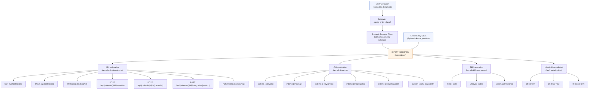
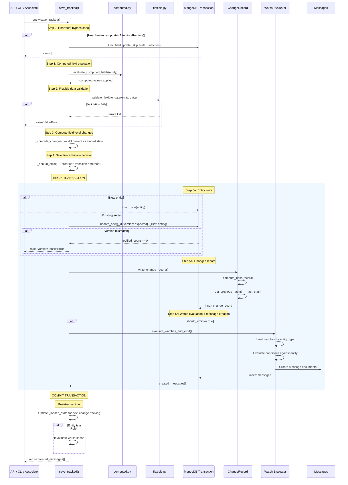
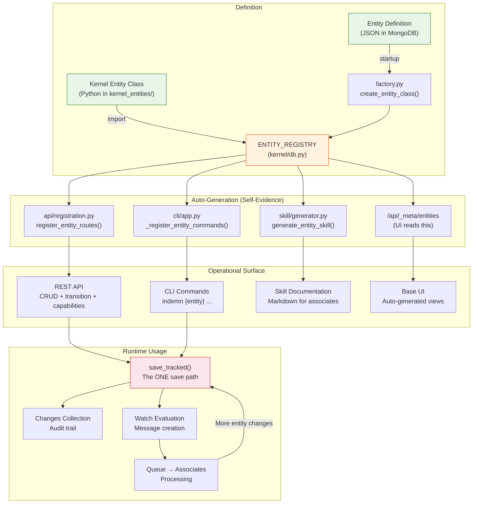

# Entity Framework

The entity framework is the foundation of the Indemn OS. Everything in the system -- submissions, emails, carriers, deals, actors, roles -- is an entity. When you define an entity, the kernel auto-generates its API endpoints, CLI commands, skill documentation, UI views, and permissions integration. This is the **self-evidence property**: building on the OS is defining what the system IS. The rest follows.

This document covers every mechanism in the entity framework end-to-end: how entities are defined, how dynamic classes are created at runtime, how saves work, how state machines enforce lifecycle, how computed fields and flexible data work, how @exposed methods and capabilities extend entities, and how the entire system ties together.

---

## 1. Entity Types

There are exactly two kinds of entities: kernel entities and domain entities. Both share the same interface. The API, CLI, and skill layers do not care which kind they are working with.

### Kernel Entities (7)

Kernel entities are Python classes in `kernel_entities/`. They are always available regardless of organization configuration. They are the entities the kernel itself depends on -- the connective tissue of the platform.

| Entity | Collection | Purpose |
|--------|-----------|---------|
| **Organization** | `organizations` | Multi-tenancy root. Every other entity belongs to an org. |
| **Actor** | `actors` | Identity. Humans, AI associates, and tier3 developers as participants. |
| **Role** | `roles` | Permissions and watches. Determines what an actor can see, do, and be notified about. |
| **Integration** | `integrations` | External system connections. Adapters, credentials, webhooks. |
| **Attention** | `attentions` | Real-time presence. Tracks who is actively working on what. |
| **Runtime** | `runtimes` | Execution environments. Async workers, chat handlers, voice handlers. |
| **Session** | `sessions` | Auth sessions. Tokens, expiry, MFA status. |

Kernel entities inherit from `KernelBaseEntity`, which extends Beanie's `Document` class (full ODM support). They are defined as standard Python classes with Pydantic field declarations, state machines, and business logic.

Example -- the Actor kernel entity (`kernel_entities/actor.py`):

```python
class Actor(BaseEntity):
    name: str
    email: Optional[str] = None
    type: Literal["human", "associate", "tier3_developer"]
    status: Literal["provisioned", "active", "suspended", "deprovisioned"] = "provisioned"
    role_ids: list[ObjectId] = Field(default_factory=list)

    # Associate-specific
    skills: Optional[list[str]] = None
    mode: Optional[Literal["deterministic", "reasoning", "hybrid"]] = None
    runtime_id: Optional[ObjectId] = None

    _state_field_name = "status"
    _state_machine = {
        "provisioned": ["active"],
        "active": ["suspended", "deprovisioned"],
        "suspended": ["active", "deprovisioned"],
    }
    _is_kernel_entity = True

    class Settings:
        name = "actors"
        indexes = [
            [("org_id", 1), ("email", 1)],
            [("org_id", 1), ("type", 1), ("status", 1)],
        ]
```

### Domain Entities

Domain entities are defined as **data in MongoDB**, not as Python code. They live in the `entity_definitions` collection and are per-org -- different organizations can define different entity types. Dynamic Python classes are created at startup via `kernel/entity/factory.py`.

Domain entities inherit from `DomainBaseEntity`, which extends Pydantic's `BaseModel` (no Beanie -- uses Motor directly for MongoDB operations). This avoids Beanie's lazy model and `ExpressionField` interference with dynamic classes.

```bash
# Create a domain entity definition
indemn entity create --data '{
  "name": "Submission",
  "collection_name": "submissions",
  "fields": {
    "title": {"type": "str", "required": true},
    "status": {"type": "str", "default": "received", "is_state_field": true},
    "carrier_id": {"type": "objectid", "is_relationship": true, "relationship_target": "Carrier"}
  },
  "state_machine": {
    "received": ["triaging"],
    "triaging": ["quoted", "declined"]
  }
}'
```

**Critical constraint**: domain entity names MUST NOT collide with kernel entity names. The kernel enforces this at startup and at runtime registration. If an org tries to define a domain entity named "Actor" or "Role", the kernel rejects it with a reserved name error.

### Shared Interface

Both entity types provide the same interface to the rest of the system:

| Method | What it does |
|--------|-------------|
| `save_tracked()` | The ONLY save path. Handles concurrency, computed fields, validation, audit, and watch emission. |
| `find_scoped(filter)` | Query with automatic `org_id` injection from request context. |
| `get_scoped(id)` | Get by ID with org isolation verification. |
| `transition_to(state)` | Validate and apply a state machine transition. Does NOT save. |
| `get_motor_collection()` | Access the underlying MongoDB collection for direct operations. |

These are defined in the `_EntityMixin` class (`kernel/entity/base.py`) and inherited by both `KernelBaseEntity` and `DomainBaseEntity`.

---

## 2. Entity Definition Format

Entity definitions are stored as documents in the `entity_definitions` MongoDB collection. The schema is defined by the `EntityDefinition` Beanie Document class in `kernel/entity/definition.py`.

### Full JSON Structure

```json
{
  "name": "Submission",
  "collection_name": "submissions",
  "description": "An insurance submission from agent to carrier",
  "fields": {
    "title": {
      "type": "str",
      "required": true,
      "description": "Submission title"
    },
    "status": {
      "type": "str",
      "default": "received",
      "is_state_field": true,
      "enum_values": ["received", "triaging", "quoted", "declined", "bound", "expired"]
    },
    "carrier_id": {
      "type": "objectid",
      "is_relationship": true,
      "relationship_target": "Carrier"
    },
    "premium": {
      "type": "decimal",
      "required": false
    },
    "tags": {
      "type": "list",
      "default": []
    },
    "metadata": {
      "type": "dict",
      "required": false
    },
    "is_priority": {
      "type": "bool",
      "default": false,
      "indexed": true
    },
    "submitted_at": {
      "type": "datetime",
      "required": false
    }
  },
  "state_machine": {
    "received": ["triaging"],
    "triaging": ["quoted", "declined"],
    "quoted": ["bound", "expired"],
    "declined": [],
    "bound": [],
    "expired": []
  },
  "computed_fields": {
    "ball_holder": {
      "source_field": "status",
      "mapping": {
        "received": "queue",
        "triaging": "underwriter",
        "quoted": "agent",
        "declined": "closed",
        "bound": "closed",
        "expired": "closed"
      }
    }
  },
  "flexible_data": {
    "schema_source": "self",
    "schema_field": "data_schema",
    "data_schema": {
      "type": "object",
      "properties": {
        "effective_date": {"type": "string", "format": "date"},
        "coverage_limit": {"type": "number"}
      }
    }
  },
  "indexes": [
    {"fields": [["status", 1], ["created_at", -1]], "unique": false}
  ],
  "activated_capabilities": [
    {
      "capability": "auto_classify",
      "config": {
        "evaluates": "classification",
        "sets_field": "classification"
      }
    }
  ],
  "org_id": "<ObjectId>",
  "version": 1
}
```

### Field Types

The `TYPE_MAP` in `kernel/entity/factory.py` maps definition type strings to Python types:

| Type | Python | Notes |
|------|--------|-------|
| `str` | `str` | Default if type not recognized |
| `int` | `int` | |
| `float` | `float` | |
| `decimal` | `Decimal` | Converted to `float` before BSON serialization |
| `bool` | `bool` | |
| `datetime` | `datetime` | |
| `date` | `datetime` | BSON has no date type -- stored as datetime |
| `objectid` | `ObjectId` | Used for relationships to other entities |
| `list` | `list` | Untyped list |
| `dict` | `dict` | Untyped dict |

### Field Options

| Option | Type | Default | Purpose |
|--------|------|---------|---------|
| `required` | `bool` | `false` | If true, field must be provided at creation |
| `default` | `Any` | `None` | Default value when not provided |
| `unique` | `bool` | `false` | Creates a unique compound index with `org_id` |
| `indexed` | `bool` | `false` | Creates a compound index with `org_id` |
| `enum_values` | `list[str]` | `None` | Runtime-validated allowed values |
| `description` | `str` | `None` | Human-readable description for skill generation |
| `is_state_field` | `bool` | `false` | Marks this field as controlled by the state machine |
| `is_relationship` | `bool` | `false` | Marks this field as a reference to another entity |
| `relationship_target` | `str` | `None` | Entity name this relationship points to (e.g., "Carrier") |

**Enum validation**: fields with `enum_values` get runtime validation injected by `factory.py`. The factory wraps `__init__` to check that provided values are in the allowed list. This validation runs before Pydantic's own validation.

**Relationship metadata**: fields with `is_relationship: true` have their target stored in `_relationship_targets` on the dynamic class. This metadata is used by scope resolution in watches (the `field_path` mechanism for ownership routing).

---

## 3. The Self-Evidence Property

This is the defining characteristic of the entity framework. When an entity is defined -- whether as a kernel Python class or as a domain entity definition in MongoDB -- the kernel automatically generates every operational surface that entity needs.

### What Gets Generated

| Surface | Generated by | Result |
|---------|-------------|--------|
| **API routes** | `kernel/api/registration.py` | `GET/POST/PUT /api/{collection_name}/`, `POST /api/{collection_name}/{id}/transition`, `POST /api/{collection_name}/{id}/{capability}` |
| **CLI commands** | `kernel/cli/app.py` (dynamic), `indemn_os/src/indemn_os/main.py` (harness) | `indemn {entity} list/get/create/update/transition/{capability}` |
| **Skill documentation** | `kernel/skill/generator.py` | Markdown with fields table, lifecycle diagram, command reference |
| **UI views** | Base UI reads entity definitions | List view, detail view, create/edit forms, state transition buttons |
| **Permissions** | Role `permissions` field | References entity type names in `read`/`write` permission arrays |

### Generation Flow



### When It Happens

**At startup** (`kernel/db.py: init_database()`):
1. Kernel entity classes are imported and registered in `ENTITY_REGISTRY`
2. All `entity_definitions` documents are loaded from MongoDB across all orgs
3. Same-name definitions across orgs are merged (union of fields)
4. Reserved name guard prevents domain/kernel name collisions
5. `create_entity_class()` produces a dynamic Pydantic class for each definition
6. `_db_ref` is set on each dynamic class so it can access Motor
7. Indexes are created/ensured for each domain entity collection
8. Watch cache is loaded

**At runtime** (`kernel/db.py: register_domain_entity()`):
When a new entity definition is created via `POST /api/entitydefinitions/`, the kernel can register it immediately without restart. The function creates the dynamic class, sets up indexes, adds it to `ENTITY_REGISTRY`, and optionally registers API routes on the running FastAPI app.

**For CLI** (`kernel/cli/app.py`):
The CLI is a separate process. On every invocation, it calls `GET /api/_meta/entities` to discover all registered entity types and dynamically creates Typer commands for each. This means the CLI always reflects the current state of entity definitions -- no restart needed, because each CLI invocation is fresh.

---

## 4. State Machine

The state machine is an optional mechanism that enforces valid lifecycle transitions on entities. It prevents invalid state jumps and ensures entities move through their lifecycle in a controlled way.

### Activation

A state machine is active when two conditions are met:
1. A field in the entity definition has `is_state_field: true`
2. The entity definition includes a `state_machine` dict mapping states to valid target states

### How It Works

Implementation: `kernel/entity/state_machine.py`

The `validate_and_apply_transition()` function:

1. **Finds the state field** -- looks up `_state_field_name` on the entity class (set by `factory.py` from `is_state_field`, or declared as a class variable on kernel entities)
2. **Reads current state** -- `getattr(entity, state_field)`
3. **Validates the transition** -- checks if `target_state` is in `state_machine[current_state]`
4. **Runs pre-transition hook** -- calls `entity._validate_pre_transition(target_state)` (override point for kernel entities to add business validation)
5. **Stores transition metadata** -- sets `entity._pending_transition = {"from": current_state, "to": target_state, "reason": reason}`
6. **Applies the change** -- `setattr(entity, state_field, target_state)`

The transition does NOT save. The caller must call `save_tracked()` after calling `transition_to()`. This is intentional -- it allows the caller to make additional field changes before saving, and it keeps the save path as the single point of truth for all entity modifications.

### State Machine Definition

The state machine is a dict where keys are states and values are lists of valid target states:

```json
{
  "received": ["triaging"],
  "triaging": ["quoted", "declined"],
  "quoted": ["bound", "expired"],
  "declined": [],
  "bound": [],
  "expired": []
}
```

Terminal states (empty list) cannot transition anywhere. States not in the dict cannot transition at all. If `_state_machine` is `None`, all transitions are allowed.

### API and CLI

State transitions are enforced through a dedicated endpoint/command. The regular update endpoint/command **rejects** changes to the state field:

```bash
# This works -- dedicated transition endpoint
indemn submission transition <id> --to triaging --reason "Initial triage"

# This fails -- update endpoint rejects state field changes
indemn submission update <id> --data '{"status": "triaging"}'
# Error: Cannot set 'status' via update. Use POST /submissions/{id}/transition instead.
```

The API registration code in `kernel/api/registration.py` explicitly checks for state field changes in the `PUT` handler and returns HTTP 400 if detected.

### Transition Events

State transitions are one of the three event types that trigger **selective emission** (see section 8). When `save_tracked()` detects `entity._pending_transition`, it sets `event_type = "transitioned"` and evaluates watches, creating messages for any matching roles.

---

## 5. Computed Fields

Computed fields are values derived from other fields via a declarative mapping. They are maintained automatically by the kernel on every save.

### Definition

Computed fields are declared in the entity definition using `ComputedFieldDef`:

```json
{
  "computed_fields": {
    "ball_holder": {
      "source_field": "status",
      "mapping": {
        "received": "queue",
        "triaging": "underwriter",
        "quoted": "agent",
        "declined": "closed",
        "bound": "closed"
      }
    }
  }
}
```

Each computed field has:
- `source_field` -- the field whose value drives the computation
- `mapping` -- a dict from source values to computed values

### Evaluation

Implementation: `kernel/entity/computed.py`

The `evaluate_computed_fields()` function runs inside `save_tracked()`, **before** the MongoDB write:

1. Reads the entity's `_computed_fields` class variable (set by `factory.py` from the definition)
2. For each computed field, reads the current value of `source_field` from the entity
3. Looks up the source value in the `mapping` dict
4. If a match is found, sets the computed field value on the entity via `setattr()`

If the source value is not in the mapping, the computed field is not updated (retains its previous value).

### Activation

Computed fields can be added to an entity definition at creation time or activated later:

```bash
# At entity creation time -- include computed_fields in the definition
indemn entity create --data '{
  "name": "Submission",
  "fields": {...},
  "computed_fields": {
    "ball_holder": {
      "source_field": "status",
      "mapping": {"received": "queue", "triaging": "underwriter"}
    }
  }
}'

# Later activation via capability enable
indemn entity enable Submission computed_fields --config '{
  "ball_holder": {"source_field": "status", "mapping": {...}}
}'
```

---

## 6. Flexible Data

Flexible data solves a common problem: entities of the same type may need different fields depending on context. For example, a Submission entity's required data varies by insurance product -- commercial auto needs vehicle schedules, professional liability needs revenue figures.

### How It Works

Implementation: `kernel/entity/flexible.py`

When an entity definition includes `flexible_data` configuration, the factory adds a `data` dict field to the dynamic class. This dict holds the flexible portion of the entity. On every save, the kernel validates this dict against a JSON Schema.

### Schema Resolution

The schema can come from two sources:

**Self-contained** (`schema_source: "self"`): The JSON Schema is embedded directly in the entity definition's `flexible_data.data_schema` field.

```json
{
  "flexible_data": {
    "schema_source": "self",
    "schema_field": "data_schema",
    "data_schema": {
      "type": "object",
      "properties": {
        "effective_date": {"type": "string", "format": "date"},
        "coverage_limit": {"type": "number"}
      },
      "required": ["effective_date"]
    }
  }
}
```

**From a related entity** (`schema_source: "<relationship_field>"`): The schema is read from a field on a related entity. For example, a Submission's flexible data schema might come from its associated Product entity's `form_schema` field.

```json
{
  "flexible_data": {
    "schema_source": "product_id",
    "schema_field": "form_schema"
  }
}
```

In this case, `validate_flexible_data()` follows the relationship:
1. Reads `entity.product_id` to get the related entity's ID
2. Resolves the target entity class via `_relationship_targets` metadata
3. Loads the related entity
4. Reads its `form_schema` field as the JSON Schema
5. Validates the entity's `data` dict against that schema

### Validation

Validation uses the `jsonschema` library. It runs inside `save_tracked()` after computed field evaluation and before the MongoDB write. If validation fails, the entire save is rejected with a `ValueError` -- no partial writes.

```bash
# Create a submission with flexible data
indemn submission create --data '{
  "title": "Acme Corp GL",
  "status": "received",
  "data": {
    "effective_date": "2026-06-01",
    "coverage_limit": 1000000
  }
}'

# This fails validation if schema requires effective_date
indemn submission create --data '{
  "title": "Bad Submission",
  "data": {"coverage_limit": 500000}
}'
# Error: Flexible data validation failed: 'effective_date' is a required property
```

---

## 7. The `save_tracked()` Path

This is **THE core invariant** of the entity framework. ALL entity saves -- creates, updates, transitions, method invocations -- go through this single function. There are no shortcuts, no bypass paths, no direct MongoDB writes.

Implementation: `kernel/entity/save.py`

### The Transaction

One MongoDB transaction, six steps. If any step fails, the entire transaction rolls back.



### Step-by-Step Detail

**Step 0 -- Heartbeat bypass**: If the entity is an `Attention` or `Runtime` and the only changed fields are heartbeat-related (`last_heartbeat`, `expires_at`, `instances`), the save takes a fast path that skips audit logging and watch evaluation. This prevents heartbeat noise from flooding the changes collection and triggering cascades. The entity is updated directly via Motor.

**Step 1 -- Computed field evaluation**: `evaluate_computed_fields()` reads each computed field's `source_field` value and applies the mapping. Computed values are set on the entity before the write, so they are stored alongside the source fields.

**Step 2 -- Flexible data validation**: If the entity has a `data` dict field and flexible data configuration, `validate_flexible_data()` resolves the JSON Schema and validates. Validation errors abort the save.

**Step 3 -- Change detection**: `_compute_changes()` compares the current entity state against `_loaded_state` (captured when the entity was loaded from MongoDB). It produces a list of `{field, old_value, new_value}` dicts. Fields like `_id`, `version`, and `updated_at` are excluded from change detection.

**Step 4 -- Selective emission decision**: `_should_emit()` determines if this save should evaluate watches and create messages. See section 8 for the full rules.

**Step 5a -- Entity write**: For new entities, `insert_one()`. For existing entities, `update_one()` with an optimistic concurrency check: the filter includes `version: expected_version`. If no document matches (another process incremented the version between load and save), `VersionConflictError` is raised and the transaction rolls back.

**Step 5b -- Changes record**: `write_change_record()` creates a `ChangeRecord` document with field-level before/after values, actor ID, correlation ID, method name, and a hash chain linking it to the previous change record for the org. This is inside the transaction -- if the write fails, the change record is also rolled back.

**Step 5c -- Watch evaluation and message creation**: If `should_emit` is true, `evaluate_watches_and_emit()` loads all watches for the entity type, evaluates their conditions against the entity, and creates `Message` documents for matching roles. Message creation is inside the same transaction -- there is no window where the entity changed but messages were not created.

### Cascade Depth Guard

The `save_tracked()` function tracks cascade depth via a `depth` parameter (sourced from `current_depth` contextvar). When depth exceeds `MAX_CASCADE_DEPTH` (10), the save succeeds but no messages are emitted. Instead, a `circuit_broken` message is created for monitoring.

Additionally, kernel entities have a self-referencing cascade guard: if a kernel entity save is triggered by a message about the same kernel entity type, emission is suppressed. This prevents infinite loops where, for example, a Role change triggers a watch that modifies the same Role.

### Post-Transaction Cleanup

After the transaction commits:
- `_loaded_state` is updated so the next `_compute_changes()` compares against the committed state
- If the entity is a `Role`, the watch cache is invalidated (because watches live on roles, and the cached watches may be stale)
- The list of created messages is returned for optimistic dispatch (the API layer fires async dispatch tasks)

---

## 8. Selective Emission

Not every entity save generates messages. This is a critical design decision for preventing watch storms -- if every field update on every entity triggered watch evaluation, a single associate processing a submission and updating 10 fields would generate 10 cascades.

### What Emits

| Event | Emits? | `event_type` value |
|-------|--------|-------------------|
| Entity creation | Yes | `"created"` |
| State transition | Yes | `"transitioned"` |
| @exposed method invocation | Yes | `"method_invoked"` |
| Entity deletion | Yes | `"deleted"` |
| Plain field update | **No** | -- |

### Priority Order

When multiple conditions are true for the same save, `_should_emit()` uses this priority:

1. **Creation** (highest) -- new entity, `event_type = "created"`
2. **Transition** -- `_pending_transition` is set, `event_type = "transitioned"`
3. **Method** -- `method` parameter provided, `event_type = "method_invoked"`
4. **No emission** (lowest) -- none of the above

### Why This Matters

Consider an associate processing an email:

```python
# Associate loads email, classifies it, sets multiple fields
email.classification = "carrier_response"
email.confidence = 0.95
email.carrier_id = carrier.id
email.summary = "Quote response from USLI"
email.processed_at = datetime.now()

# This save does NOT emit -- it's a plain field update
await email.save_tracked()

# Later, the associate transitions the email
email.transition_to("classified")
# This save DOES emit -- it's a state transition
await email.save_tracked()
```

The associate can update as many fields as it wants without triggering cascades. Only the transition at the end emits a message, and that message carries all the changes made during processing.

### The @exposed Method Pattern

When a capability is invoked (e.g., `auto_classify`), the save at the end uses `method="auto_classify"`. This generates ONE event covering all changes made by the method. Rules that run inside the method do not independently generate events.

```bash
# This invokes auto_classify, which may set multiple fields via rules
# Only ONE message is created at the end
indemn submission auto-classify <id> --auto
```

---

## 9. @exposed Methods

The `@exposed` decorator marks kernel entity methods for automatic API and CLI route generation. For domain entities, the equivalent mechanism is **capability activation**.

### Kernel Entity Methods

Implementation: `kernel/entity/exposed.py`

```python
from kernel.entity.exposed import exposed

class Integration(BaseEntity):
    @exposed
    async def rotate_credentials(self):
        """Rotate this integration's credentials."""
        ...

    @exposed(name="health-check")
    async def check_health(self):
        """Test connectivity to the external system."""
        ...
```

The `@exposed` decorator sets `_exposed = True` and `_exposed_name` on the method. During API registration (`kernel/api/registration.py`), the registration code scans all attributes of the entity class and registers a `POST /api/{collection}/{id}/{method-name}` route for each exposed method.

### Domain Entity Capabilities

Domain entities cannot have Python methods (they are dynamic classes). Instead, they use **capability activations** -- references to kernel capability functions registered in `kernel/capability/registry.py`.

Available capabilities:

| Capability | What it does |
|-----------|-------------|
| `auto_classify` | Evaluate rules to classify an entity. Returns `needs_reasoning: true` if no rule matches. |
| `fuzzy_search` | Search for matching entities using fuzzy string comparison |
| `stale_check` | Check if entity has been in current state longer than threshold |
| `fetch_new` | Collection-level: pull new entities from an integration source |
| `pattern_extract` | Extract structured data from unstructured content using rules/LLM |
| `auto_link` | Automatically link this entity to related entities based on matching rules |
| `auto_route` | Route entity to appropriate role/actor based on rules |

### Activation

Capabilities are activated on entity types via the definition:

```bash
# At entity creation time
indemn entity create --data '{
  "name": "Email",
  "fields": {...},
  "activated_capabilities": [
    {
      "capability": "auto_classify",
      "config": {"evaluates": "classification", "sets_field": "classification"}
    },
    {
      "capability": "fetch_new",
      "config": {"integration_type": "email", "method": "list_messages"}
    }
  ]
}'

# Or activate later
indemn entity enable Email auto_classify --config '{"evaluates": "classification", "sets_field": "classification"}'
```

### The `--auto` Pattern

Capabilities support a critical pattern: `--auto` flag means "try rules first, fall back to LLM if needed."

```bash
# Try rules first. If a rule matches, apply deterministically. If not, return needs_reasoning.
indemn email auto-classify <id> --auto
```

The API handler for capability routes (`_register_capability_route` in `kernel/api/registration.py`):

1. Loads the entity
2. If `auto=true`, calls the registered capability function
3. The capability function evaluates rules against the entity
4. If rules produce a result (`needs_reasoning: false`), the result is applied and saved with `method=cap_name`
5. If no rules match (`needs_reasoning: true`), the result is returned without saving -- the associate's LLM can then handle it

### Collection-Level Capabilities

Some capabilities operate at the collection level (no specific entity ID), such as `fetch_new` which creates new entities from an integration source:

```bash
# Fetch new emails from the integration
indemn email fetch-new
```

These are registered as `POST /api/{collection}/{capability}` (without `{id}` in the path). FastAPI matches fixed paths before parameterized paths, so `/api/emails/fetch-new` is matched before `/api/emails/{entity_id}`.

---

## 10. Schema Migration

Entity definitions evolve over time. The migration system provides first-class support for changing entity schemas with safety guarantees.

Implementation: `kernel/entity/migration.py`

### When Migration Is Needed

**Additive changes do NOT need migration**: adding a new field to an entity definition requires no data migration. Pydantic uses default values for fields not present in existing MongoDB documents. The old data stays in MongoDB and works fine with the new class.

**Removing a field does NOT need migration**: removing a field from the definition means existing data in MongoDB is simply ignored when loading documents. The old values stay in the database but are not exposed through the entity class. Optional cleanup can remove the old data.

**Renaming a field DOES need migration**: existing documents have the old field name and need to be updated.

### Operations

| Operation | What it does |
|-----------|-------------|
| `rename_field` | Renames a field across all documents + updates the entity definition |
| `add_field` | Adds a field to the entity definition (no document changes needed) |
| `remove_field` | Removes a field from the definition, optionally `$unset`s it from all documents |

### Execution

Migrations run in two phases: planning and execution.

```bash
# Plan: preview what will happen
indemn entity migrate --entity Submission --operations '[
  {"type": "rename_field", "from": "old_name", "to": "new_name"},
  {"type": "add_field", "name": "priority", "field_def": {"type": "str", "default": "normal"}},
  {"type": "remove_field", "name": "deprecated_field", "cleanup": true}
]' --dry-run

# Execute for real
indemn entity migrate --entity Submission --operations '[...]'
```

The `plan_migration()` function:
1. Resolves the entity class from `ENTITY_REGISTRY`
2. Counts affected documents (org-scoped)
3. Samples up to 5 documents for preview

The `execute_migration()` function:
1. Iterates through operations
2. For `rename_field`: processes documents in batches within MongoDB transactions, then updates the `EntityDefinition`
3. For `add_field`: only updates the `EntityDefinition` (no document migration needed)
4. For `remove_field`: updates the `EntityDefinition`, and if `cleanup: true`, runs `$unset` across all documents
5. Returns status with processed count and any errors

### Batch Processing

`rename_field` operations process documents in configurable batch sizes (default 100). Each batch runs in its own MongoDB transaction. Progress is logged. This prevents long-running transactions and allows monitoring of migration progress.

---

## 11. Entity Lifecycle

This diagram shows the complete lifecycle of an entity from definition to operational use.



### Startup Sequence

1. `init_database()` is called during API server startup
2. MongoDB connection is established
3. Kernel entity classes are imported and registered
4. Beanie is initialized with all kernel models (including `EntityDefinition`)
5. All `entity_definitions` documents are loaded from MongoDB
6. Same-name definitions across orgs are merged (union of fields)
7. Reserved name guard rejects any domain entity named after a kernel entity
8. `create_entity_class()` produces dynamic classes for each domain definition
9. Each dynamic class gets `_db_ref` set for Motor operations
10. Indexes are created/ensured for each domain entity collection
11. Watch cache is loaded from all Role entities

### Runtime Registration

When a new entity definition is created via the API, `register_domain_entity()` handles live registration:
1. Validates the name against reserved names
2. Creates the dynamic class via `create_entity_class()`
3. Sets `_db_ref` for Motor access
4. Adds to `ENTITY_REGISTRY`
5. Creates indexes
6. Registers API routes on the running FastAPI app

The CLI does not need live registration because each CLI invocation is a fresh process that discovers entities via `GET /api/_meta/entities`.

---

## 12. Database Patterns

### Org-Scoped Queries

Every entity query must be scoped to the current organization. This is enforced by the `find_scoped()` and `get_scoped()` methods on both base classes.

For **kernel entities** (Beanie): `find_scoped()` injects `org_id` into the filter document and returns a Beanie query object.

For **domain entities** (Motor): `find_scoped()` injects `org_id` and returns a `_DomainQuery` wrapper that provides the same interface (`.sort()`, `.skip()`, `.limit()`, `.to_list()`, `.count()`).

The `org_id` is read from `current_org_id` contextvar, which is set by the auth middleware on every API request.

```python
# These are equivalent -- both inject org_id automatically
submissions = await Submission.find_scoped({"status": "received"}).to_list()
submissions = await Submission.find_scoped({"status": "received"}).sort("-created_at").limit(20).to_list()

# Cross-org access is blocked
entity = await Submission.get_scoped(entity_id)
# If entity.org_id != current_org_id → raises PermissionError("Cross-org access denied")
```

### Never Raw Motor

All entity queries go through `find_scoped()` / `get_scoped()`. Direct Motor collection access is available via `get_motor_collection()` but is reserved for infrastructure operations (migrations, bulk updates, index management) where org scoping is handled explicitly.

### Context Variables

Implementation: `kernel/context.py`

Five context variables are available throughout the request lifecycle:

| Variable | Set by | Used by |
|----------|--------|---------|
| `current_org_id` | Auth middleware | `find_scoped()`, `get_scoped()`, entity creation |
| `current_actor_id` | Auth middleware | `save_tracked()` for audit trail |
| `current_correlation_id` | Request middleware | Change records, messages, trace queries |
| `current_depth` | Message processing | Cascade depth guard in `save_tracked()` |
| `current_causation_message_id` | Message processing | Links messages to their cause for trace trees |

### Beanie vs Motor

Kernel entities use Beanie (full ODM with hooks, state management, lazy loading). Domain entities use Motor directly via the `DomainBaseEntity` base class. This split exists because:

- Beanie's `create_model` integration has issues with dynamic classes (ExpressionField interference)
- Domain entities need to be created at runtime from data, not defined as static classes
- Motor provides the necessary operations (insert, find, update) without the ODM overhead
- Both share the same interface through `_EntityMixin`, so the API/CLI layers are unaware of the difference

### Change Tracking

Both base classes capture `_loaded_state` when an entity is loaded from MongoDB:

- **KernelBaseEntity**: uses Beanie's `after_find` hook to call `self._loaded_state = self.model_dump(by_alias=True)`
- **DomainBaseEntity**: sets `_loaded_state` in `get()`, `find_one()`, and `_DomainQuery.to_list()`

This loaded state is compared against the current state in `_compute_changes()` during `save_tracked()` to produce field-level change records.

---

## 13. Naming Conventions

| Context | Convention | Example |
|---------|-----------|---------|
| Python code | `snake_case` | `ball_holder`, `carrier_id`, `is_priority` |
| CLI commands | `kebab-case` | `indemn submission auto-classify`, `--auto`, `--to` |
| MongoDB collections | lowercase plural | `submissions`, `emails`, `actors` |
| Entity classes | PascalCase singular | `Submission`, `Email`, `Actor` |
| API routes | `/api/{collection_name}/` | `/api/submissions/`, `/api/actors/` |
| Capability names | `snake_case` in code, `kebab-case` in CLI/API | `auto_classify` / `auto-classify` |
| Field names | `snake_case` | `carrier_id`, `created_at`, `is_state_field` |

The conversion between conventions happens automatically:
- `factory.py` uses the `collection_name` from the definition for Motor operations
- `registration.py` converts entity names to API slugs: `entity_name.lower() + "s"`
- CLI registration converts capability names: `cap["name"].replace("_", "-")`

---

## Key Files Reference

| File | What |
|------|------|
| `kernel/entity/base.py` | `KernelBaseEntity`, `DomainBaseEntity`, `_EntityMixin`, `_DomainQuery` |
| `kernel/entity/definition.py` | `EntityDefinition`, `FieldDefinition`, `ComputedFieldDef`, `FlexibleDataSchema`, `CapabilityActivation`, `IndexDef` |
| `kernel/entity/factory.py` | `create_entity_class()` -- dynamic class creation from `EntityDefinition` |
| `kernel/entity/save.py` | `save_tracked_impl()` -- the ONE save path |
| `kernel/entity/state_machine.py` | `validate_and_apply_transition()` -- state machine enforcement |
| `kernel/entity/computed.py` | `evaluate_computed_fields()` -- computed field evaluation |
| `kernel/entity/flexible.py` | `validate_flexible_data()` -- JSON Schema validation for flexible data |
| `kernel/entity/exposed.py` | `@exposed` decorator for kernel entity methods |
| `kernel/entity/migration.py` | `plan_migration()`, `execute_migration()` -- schema migration |
| `kernel/db.py` | `init_database()`, `register_domain_entity()`, `ENTITY_REGISTRY` |
| `kernel/api/registration.py` | `register_entity_routes()` -- auto-generate API endpoints |
| `kernel/cli/app.py` | `_register_entity_commands()` -- auto-generate CLI commands |
| `kernel/skill/generator.py` | `generate_entity_skill()` -- auto-generate skill documentation |
| `kernel/capability/registry.py` | `CAPABILITY_REGISTRY`, `register_capability()`, `get_capability()` |
| `kernel/changes/collection.py` | `ChangeRecord`, `write_change_record()` -- audit trail |
| `kernel/context.py` | Request-scoped context variables (`current_org_id`, etc.) |
| `kernel_entities/` | 7 kernel entity Python classes |
