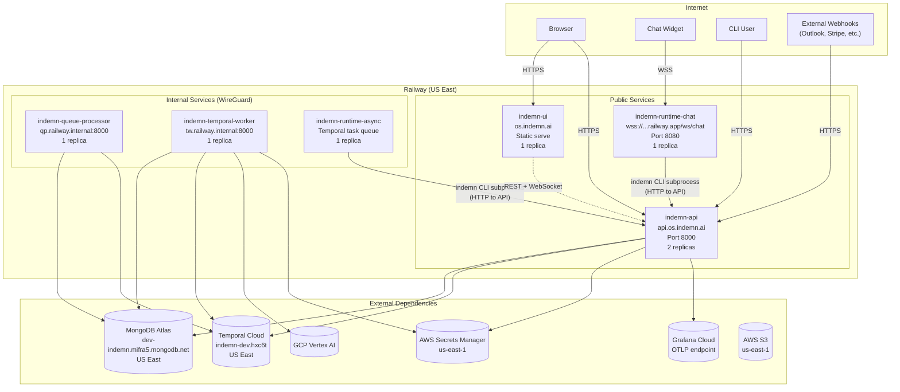

# Infrastructure & Deployment

This document describes the deployment topology, networking, local development setup, scaling strategy, and cost model for the Indemn OS. A senior developer who has never seen this system should understand how the platform is deployed, how to run it locally, and how it scales after reading this document.

---

## Five Services from One Kernel Image

The kernel is a single Docker image (`indemn-kernel`) built from the root `Dockerfile`. The `entrypoint.sh` dispatches based on the `SERVICE_TYPE` environment variable:

```bash
case "$SERVICE_TYPE" in
  api)             exec uv run opentelemetry-instrument python -m kernel.api.app ;;
  queue_processor) exec uv run opentelemetry-instrument python -m kernel.queue_processor ;;
  temporal_worker) exec uv run opentelemetry-instrument python -m kernel.temporal.worker ;;
esac
```

Harness images are separate Dockerfiles in `harnesses/`:

| Image | Dockerfile | What It Runs |
|-------|-----------|-------------|
| `indemn-kernel` | `Dockerfile` (root) | API Server, Queue Processor, Temporal Worker |
| `indemn-runtime-chat` | `harnesses/chat-deepagents/Dockerfile` | Chat harness (WebSocket, real-time) |
| `indemn-runtime-async` | `harnesses/async-deepagents/Dockerfile` | Async harness (Temporal activity worker) |
| `indemn-ui` | `ui/Dockerfile` | React + Vite static site |

---

## Deployment Topology



### Railway Services

| Service | URL | Visibility | Replicas | Image |
|---------|-----|-----------|----------|-------|
| **indemn-api** | `https://api.os.indemn.ai` | Public | 2 | `indemn-kernel` |
| **indemn-ui** | `https://os.indemn.ai` | Public | 1 | `ui/Dockerfile` |
| **indemn-runtime-chat** | `wss://indemn-runtime-chat-production.up.railway.app/ws/chat` | Public | 1 | `harnesses/chat-deepagents/Dockerfile` |
| **indemn-queue-processor** | `qp.railway.internal:8000` | Internal | 1 | `indemn-kernel` |
| **indemn-temporal-worker** | `tw.railway.internal:8000` | Internal | 1 | `indemn-kernel` |
| **indemn-runtime-async** | Temporal task queue: `indemn-async-worker` | Internal | 1 | `harnesses/async-deepagents/Dockerfile` |

---

## Internal Networking

Railway provides a WireGuard-based private network. Internal services communicate using `<service-name>.railway.internal:<PORT>` addresses.

| From | To | Address | Protocol |
|------|-----|---------|----------|
| Queue Processor | MongoDB Atlas | `dev-indemn.mifra5.mongodb.net:27017` | TLS (MongoDB wire) |
| Queue Processor | Temporal Cloud | `indemn-dev.hxc6t.tmprl.cloud:7233` | gRPC + TLS |
| Temporal Worker | MongoDB Atlas | Same as above | TLS |
| Temporal Worker | Temporal Cloud | Same as above | gRPC + TLS |
| Chat Harness | API Server | `indemn-api.railway.internal:8000` | HTTP (private network) |
| Async Harness | API Server | `indemn-api.railway.internal:8000` | HTTP (private network) |
| All kernel services | Grafana Cloud | OTLP endpoint (HTTPS) | gRPC + TLS |
| All kernel services | AWS | `secretsmanager.us-east-1.amazonaws.com` | HTTPS |

**No public exposure for internal services.** The queue processor, temporal worker, and async harness have no public URLs. They are only reachable within Railway's private network or via their configured external dependencies.

---

## Shared Environment Variables

All kernel services share these environment variables, configured in Railway's service settings:

| Variable | Description | Example |
|----------|-------------|---------|
| `MONGODB_URI` | Atlas connection string | `mongodb+srv://...@dev-indemn.mifra5.mongodb.net` |
| `MONGODB_DATABASE` | Database name | `indemn_os` |
| `AWS_ACCESS_KEY_ID` | For Secrets Manager and S3 | `AKIA...` |
| `AWS_SECRET_ACCESS_KEY` | For Secrets Manager and S3 | `...` |
| `AWS_REGION` | AWS region | `us-east-1` |
| `TEMPORAL_ADDRESS` | Temporal Cloud endpoint | `indemn-dev.hxc6t.tmprl.cloud:7233` |
| `TEMPORAL_NAMESPACE` | Temporal namespace | `indemn-dev.hxc6t` |
| `TEMPORAL_TLS_CERT` | Temporal mTLS certificate (base64) | `...` |
| `TEMPORAL_TLS_KEY` | Temporal mTLS key (base64) | `...` |
| `JWT_SIGNING_KEY` | HMAC key for JWT signatures | `...` |
| `INDEMN_API_URL` | API server URL (for CLI and harnesses) | `https://api.os.indemn.ai` |
| `OTEL_EXPORTER_OTLP_ENDPOINT` | Grafana Cloud OTLP | `https://otlp-gateway-prod-us-east-0.grafana.net/otlp` |
| `OTEL_EXPORTER_OTLP_HEADERS` | Grafana Cloud auth | `Authorization=Basic ...` |
| `SERVICE_TYPE` | Kernel entry point selector | `api`, `queue_processor`, `temporal_worker` |

---

## Region Co-Location

All services are co-located in US East to minimize latency between components:

| Service | Region | Latency to API |
|---------|--------|---------------|
| Railway (all services) | US East | < 1ms (private network) |
| MongoDB Atlas | US East (AWS) | 1-3ms |
| Temporal Cloud | US East | 2-5ms |
| AWS Secrets Manager | us-east-1 | 1-3ms |
| Grafana Cloud | US East | Fire-and-forget (no latency impact) |

The save path (entity write + changes + watch eval + messages) executes in a single MongoDB transaction. Co-location keeps this transaction under 10ms in the common case.

---

## CLI Always API Mode

The `indemn` CLI binary is always an HTTP client to the API server. It never connects to MongoDB directly. This means:

- One auth path: CLI authenticates the same way as the UI or any other client
- One permission path: all operations go through `check_permission()` in the API middleware
- No separate database credentials for CLI users
- Same rate limiting and audit logging as any other client

```bash
# CLI reads INDEMN_API_URL from environment
export INDEMN_API_URL=https://api.os.indemn.ai

# All commands are HTTP calls
indemn submission list          # GET /submission
indemn submission create --data '{...}'  # POST /submission
indemn submission transition sub_789 --to classified  # POST /submission/sub_789/transition
```

For local development, point the CLI at the local API server:

```bash
export INDEMN_API_URL=http://localhost:8000
```

---

## Local Development Setup

Local development connects to remote dependencies (MongoDB Atlas, Temporal Cloud) but runs kernel services locally.

### Terminal Layout

```
Terminal 1: API Server
  uvicorn kernel.api.app:create_app --factory --reload --port 8000

Terminal 2: Queue Processor
  python -m kernel.queue_processor

Terminal 3: Temporal Server (local)
  temporal server start-dev --port 7233 --ui-port 8233

Terminal 4: Temporal Worker
  python -m kernel.temporal.worker

Terminal 5: UI Dev Server
  cd ui && npm run dev

Terminal 6 (optional): Harness
  cd harnesses/chat-deepagents && python -m harness.main
```

### Quick Start

```bash
# Clone and install
git clone git@github.com:indemn-ai/indemn-os.git
cd indemn-os
uv sync

# Set environment (copy from .env.example, fill in credentials)
cp .env.example .env
# Edit .env with MongoDB URI, AWS keys, etc.

# Start Temporal local server
temporal server start-dev --port 7233 --ui-port 8233 &

# Start kernel services
source .env
uvicorn kernel.api.app:create_app --factory --reload --port 8000 &
python -m kernel.queue_processor &
python -m kernel.temporal.worker &

# Start UI
cd ui && npm install && npm run dev &

# Verify
curl http://localhost:8000/health
# {"status": "healthy", "mongodb": "connected", "temporal": "connected"}
```

### Docker Compose

For a containerized local environment:

```bash
docker compose up
# API: http://localhost:8000
# Temporal UI: http://localhost:8233
# MongoDB: connects to Atlas via MONGODB_URI
```

---

## Deployment Strategies

### Code Change (Most Common)

Push to the deploy branch triggers Railway auto-build:

```
git push origin main
  --> Railway detects push
  --> Builds indemn-kernel image
  --> Rolling deploy: new instance starts, health check passes, old instance drains
  --> Zero downtime (API has 2 replicas, one stays live during deploy)
```

### Entity Type Change

Entity definitions live in MongoDB, not code. Changing a domain entity definition does not require a code deploy:

```bash
# Add a new field to an entity type
indemn entity update Submission --add-field '{"name": "priority_override", "type": "string", "required": false}'
```

The change takes effect immediately for API and CLI. The queue processor and temporal worker pick it up on their next entity load (within seconds). For structural changes (new state machine states, new computed fields), a rolling restart of kernel services is recommended:

```bash
# Railway restart (via Railway CLI or dashboard)
railway service restart indemn-api
railway service restart indemn-queue-processor
railway service restart indemn-temporal-worker
```

### Kernel Upgrade (Major Changes)

For kernel code changes that affect entity behavior, a dry-run + apply pattern:

```bash
# 1. Dry-run migration
indemn entity migrate --dry-run
# Shows what would change, affected entities, estimated time

# 2. Apply migration
indemn entity migrate --apply
# Applies changes, writes migration record to changes collection

# 3. Deploy new kernel code
git push origin main
# Railway builds and deploys
```

---

## Scaling Triggers

| Signal | Threshold | Action |
|--------|-----------|--------|
| API latency P95 | > 500ms sustained 5 min | Add API replica |
| Temporal queue depth | > 100 pending workflows sustained 5 min | Add Temporal Worker replica |
| Message backlog | > 500 pending messages sustained 5 min | Add Queue Processor replica |
| Harness session count | > capacity on any Runtime | Add harness replica, update Runtime.instances |
| MongoDB connections | > 80% of pool limit | Increase pool size or add replica |

### Connection Pool Sizing

| Service | Pool Size | Rationale |
|---------|-----------|-----------|
| API Server | 50 | Handles concurrent HTTP requests, each may need a connection |
| Queue Processor | 10 | Single-threaded sweep loop, low concurrency |
| Temporal Worker | 30 | Multiple concurrent workflows, each with DB operations |
| Chat Harness | 5 per instance | CLI subprocess calls go through API, not direct DB |

Pool sizes are configured via `MONGODB_MAX_POOL_SIZE` environment variable per service.

---

## Production Requirements

### WebSocket Keepalive

Chat harness WebSocket connections require keepalive pings to prevent proxy/load balancer timeouts:

- **Ping interval:** 30 seconds
- **Pong timeout:** 15 seconds (disconnect if no pong received)
- Railway's proxy timeout: 60 seconds for idle connections

Implementation in `harnesses/chat-deepagents/main.py`.

### External Health Monitoring

Railway's built-in health checks verify the container is running but do not verify application health. External monitoring (e.g., Grafana synthetic monitoring) should hit:

```
GET https://api.os.indemn.ai/health
```

Expected response:

```json
{
  "status": "healthy",
  "mongodb": "connected",
  "temporal": "connected",
  "uptime_seconds": 86400,
  "version": "0.1.0"
}
```

### Log Shipping

All kernel services emit structured JSON logs to stdout. Railway captures these and forwards to Grafana Cloud Logs via the configured OTLP endpoint. Log format:

```json
{"level": "info", "message": "Entity saved", "entity_type": "Submission", "entity_id": "sub_789", "correlation_id": "trace_abc123", "timestamp": "2026-04-22T14:30:00.123Z"}
```

### WAF

A Web Application Firewall should be deployed before the first customer goes live. Railway supports custom domains with Cloudflare or AWS CloudFront as a WAF layer in front of the API server.

---

## Cost Model

### MVP (1-5 Customers)

| Item | Monthly Cost |
|------|-------------|
| Railway (6 services, starter plans) | $60 |
| MongoDB Atlas (M10, shared) | $60 |
| Temporal Cloud (free tier) | $0 |
| AWS (Secrets Manager + S3) | $10 |
| Grafana Cloud (free tier) | $0 |
| GCP Vertex AI (usage-based) | $50 |
| Domain + DNS | $20 |
| **Total** | **~$200/mo** |

### 50 Customers

| Item | Monthly Cost |
|------|-------------|
| Railway (scaled services, pro plans) | $400 |
| MongoDB Atlas (M30, dedicated) | $450 |
| Temporal Cloud (usage-based) | $200 |
| AWS (Secrets Manager + S3 + data transfer) | $50 |
| Grafana Cloud (pro tier) | $100 |
| GCP Vertex AI (usage-based) | $400 |
| Cloudflare WAF | $50 |
| External monitoring | $50 |
| **Total** | **~$1,700/mo** |

**Primary cost drivers:** Railway compute (always-on services) and MongoDB Atlas (storage + IOPS) at MVP scale. GCP Vertex AI (LLM usage) becomes dominant at 50 customers.

---

## Backup and Recovery

| Component | Backup Method | Recovery Time |
|-----------|--------------|---------------|
| **MongoDB Atlas** | Continuous backup with point-in-time recovery (PITR) | Minutes (Atlas automated) |
| **Temporal Cloud** | Durable state (Temporal manages persistence) | Automatic (workflows resume after outage) |
| **AWS S3** | Versioning enabled on all buckets | Immediate (restore previous version) |
| **AWS Secrets Manager** | Versioned secrets with rotation history | Immediate (restore previous version) |
| **Changes collection** | IS the backup -- complete config and data history | Replay from any point (manual, but possible) |

The changes collection serves as a de facto backup for all entity configuration. Because it records every field-level change with old and new values, any entity can be reconstructed to any prior state by replaying the change history. This is not a replacement for MongoDB backup (which handles collection-level recovery), but it provides entity-level recovery that traditional backups cannot.

```bash
# View entity state at a point in time (reconstructed from changes)
indemn trace entity Submission sub_789 --at 2026-04-20T00:00:00Z
```
