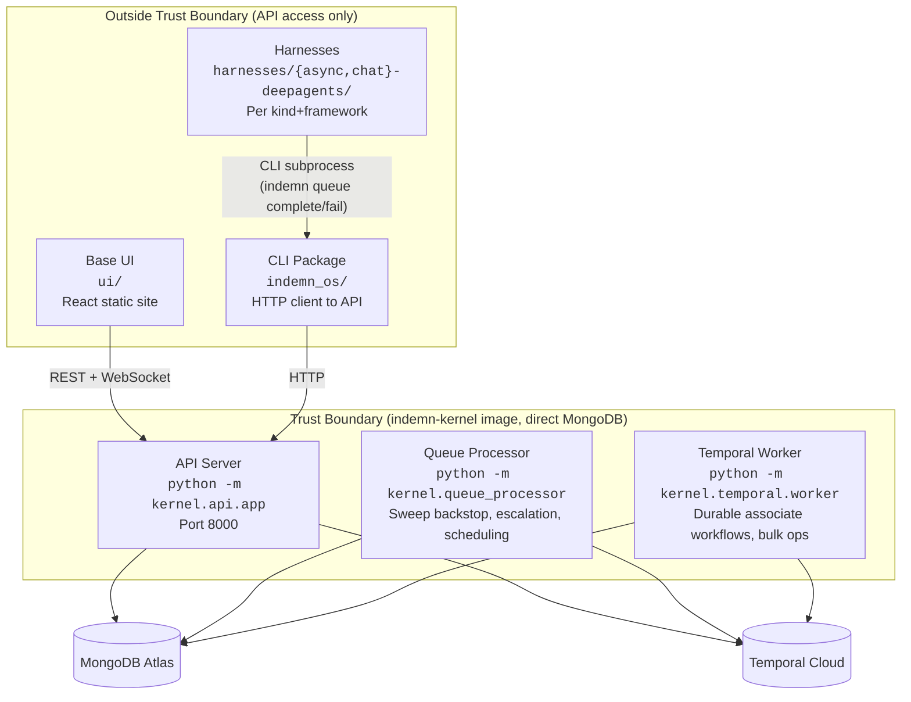
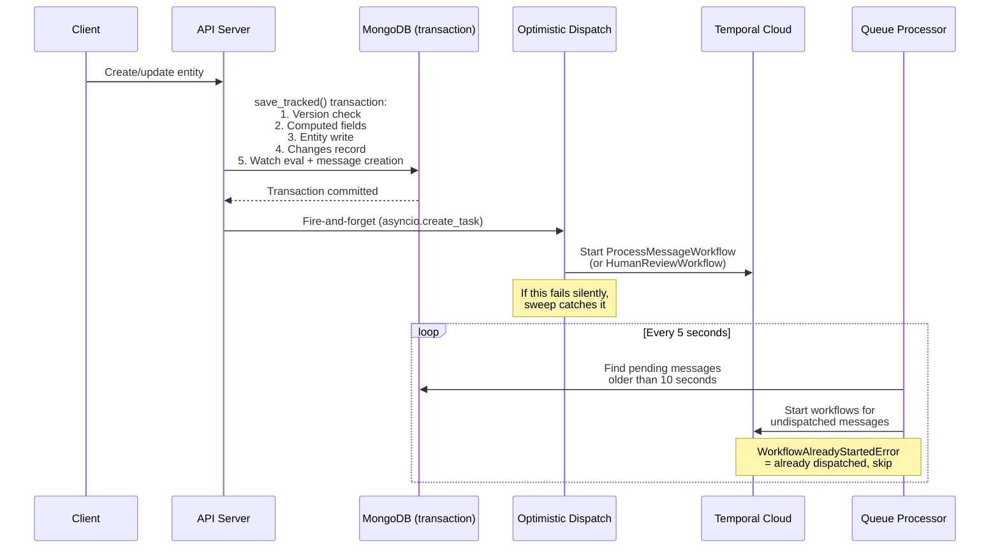
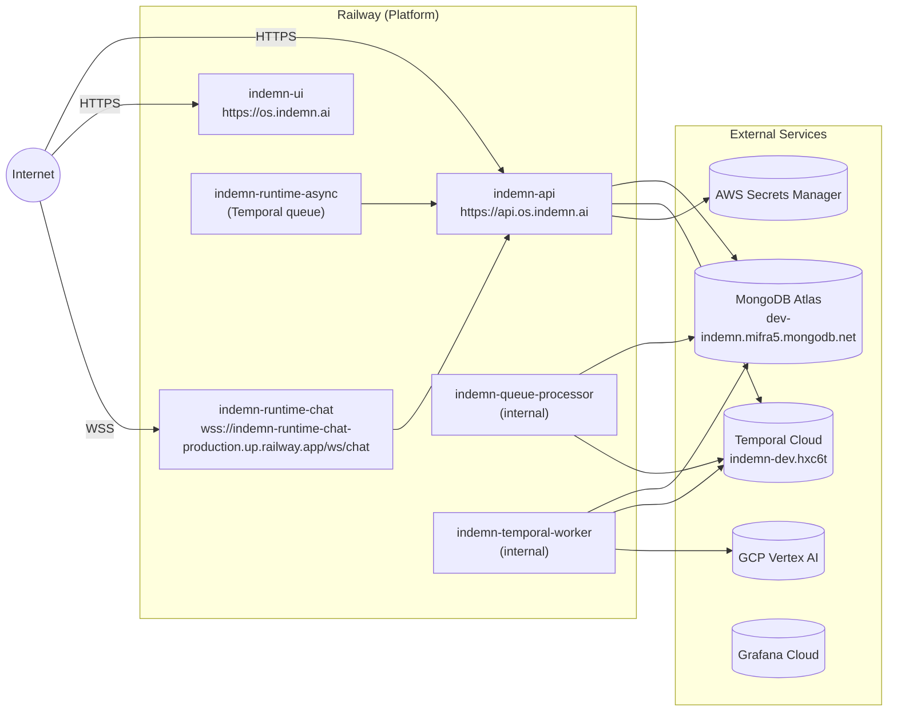

# System Architecture Overview

This document describes the architecture of the Indemn OS -- a domain-agnostic platform kernel that auto-generates API, CLI, documentation, permissions, and UI from entity definitions. A senior developer who has never seen this system should understand exactly what it is and how it works after reading this document.

---

## What the OS Is

The Indemn OS is a modular monolith built on six structural primitives (Entity, Message, Actor, Role, Organization, Integration) and seven kernel entities. The system has two layers:

- **Kernel layer** (platform, domain-agnostic): Python code in `kernel/` and `kernel_entities/`. Ships as a Docker image. Provides entity management, message routing, authentication, observability, and integration dispatch. Never changes per customer.
- **Domain layer** (per-business configuration): Data in MongoDB. Entity definitions, watches, rules, skills, lookups, and associate configs. Different organizations run different domain models on the same kernel.

The defining property of the system is **self-evidence**: define an entity and its API endpoints, CLI commands, skill documentation, permissions checks, and UI views exist immediately. You do not build these separately. The platform reads entity definitions (from Python classes for kernel entities, from MongoDB documents for domain entities) and auto-generates everything via `kernel/api/registration.py`, `kernel/cli/registration.py`, and `kernel/skill/generator.py`.

This means building on the OS is defining what the system IS. The rest follows.

---

## The Trust Boundary

Five services run from one Docker image (`indemn-kernel`). The trust boundary separates services that access MongoDB directly from those that authenticate via the API.



**Inside the trust boundary** -- three entry points from one image, selected by `SERVICE_TYPE` env var in `entrypoint.sh`:

| Service | Entry Point | Responsibility |
|---------|-------------|----------------|
| **API Server** | `python -m kernel.api.app` | REST API (FastAPI), WebSocket, webhooks, auth middleware. The only internet-facing kernel service. All CLI commands, UI interactions, and harness operations route through it. |
| **Queue Processor** | `python -m kernel.queue_processor` | Sweep backstop for missed dispatches, visibility timeout recovery, escalation deadline checks, scheduled associate execution, Attention TTL cleanup, zombie session detection. Runs on a 5-second loop. NOT primary dispatch -- that happens in the API server. |
| **Temporal Worker** | `python -m kernel.temporal.worker` | Durable workflow execution: `ProcessMessageWorkflow` (associate claim/dispatch), `HumanReviewWorkflow` (signal-based human decisions with escalation timeout), `BulkExecuteWorkflow` (batched operations with progress tracking). |

**Outside the trust boundary** -- authenticate via API, never import kernel code directly:

| Service | Location | Responsibility |
|---------|----------|----------------|
| **Base UI** | `ui/` | React + Vite + Tailwind static site. Connects to API only. |
| **Harnesses** | `harnesses/{async,chat}-deepagents/` | Per kind+framework execution environments. Use CLI subprocess (`indemn queue complete`, `indemn queue fail`) for ALL OS operations. Never import kernel modules. |
| **CLI Package** | `indemn_os/` | The `indemn` binary. Always an HTTP client to the API server. Distributed as a pip-installable package. |

---

## The Dispatch Pattern

Message dispatch uses an optimistic-then-sweep pattern that guarantees delivery without blocking the save transaction.



The key sequence in `kernel/entity/save.py`:

1. `save_tracked()` opens a MongoDB transaction
2. Inside the transaction: optimistic concurrency check, computed field evaluation, flexible data validation, entity write, changes record (with hash chain), watch evaluation producing messages
3. Transaction commits
4. AFTER commit: `kernel/message/dispatch.py::optimistic_dispatch()` fires and forgets a Temporal workflow start
5. If optimistic dispatch fails (Temporal unavailable, network issue): the queue processor sweep in `kernel/queue_processor.py::dispatch_associate_workflows()` finds pending messages older than 10 seconds and dispatches them
6. If the workflow was already started by optimistic dispatch, Temporal returns `WorkflowAlreadyStartedError` and the sweep moves on

This ensures: immediate dispatch in the happy path, automatic recovery in the failure path, and exactly-once execution via Temporal's workflow ID deduplication.

**Selective emission**: not every entity save produces messages. Only three events emit: entity creation, state transitions, and `@exposed` method invocations. Regular field updates do NOT generate messages. This is enforced in `save_tracked()` via the `_should_emit()` check.

---

## How Everything Connects

The universal pattern of the system is a churning loop:

```
Entry point
  --> creates/updates entity
    --> save_tracked() commits (atomic: write + changes + watch eval + messages)
      --> watches fire on matching roles
        --> actors process (associate via Temporal, human via review workflow)
          --> processing creates/updates MORE entities
            --> more watches fire
              --> ... until human checkpoint or final state
```

### Entry Points

| Entry Point | Mechanism | Example |
|-------------|-----------|---------|
| Channel | WebSocket connection to chat/voice harness | Customer sends message via widget |
| Webhook | Inbound HTTP to `kernel/api/webhook.py` | Outlook sends new email notification |
| API Call | REST endpoint hit by CLI, UI, or tier-3 developer | `indemn submission create --data '{...}'` |
| Polling | Scheduled associate on cron | `trigger_schedule: "*/5 * * * *"` on an Actor |
| CLI Command | Human runs `indemn` binary | `indemn email transition <id> --to classified` |
| Form Submission | UI posts to entity create endpoint | User fills out submission intake form |

### Actor Triggers

| Trigger | Mechanism | Code Path |
|---------|-----------|-----------|
| Message (watch match) | Entity change matches watch conditions on a role | `kernel/message/emit.py` -> `kernel/message/dispatch.py` -> `kernel/temporal/workflows.py::ProcessMessageWorkflow` |
| Schedule (cron) | Queue processor evaluates `trigger_schedule` on active associates | `kernel/queue_processor.py::check_scheduled_associates()` |
| Direct invocation | API call bypasses watch routing for real-time latency | `kernel/api/direct_invoke.py` |

### Cascade Control

The system prevents infinite loops via two mechanisms:

- **Depth tracking**: every message carries a `depth` counter, incremented at each cascade level. At `MAX_CASCADE_DEPTH` (10), a `circuit_broken` message is written and processing stops (`kernel/entity/save.py`, line 82-96).
- **Kernel entity cascade guard**: kernel entities (Organization, Actor, Role, etc.) skip emission when triggered by changes to their own type, preventing self-referencing cascades (line 99-106).

---

## Everything Is Data

The OS codebase (git repository) is the **platform**. MongoDB is the **application**.

| Concept | Where It Lives | Implication |
|---------|---------------|-------------|
| Entity definitions | MongoDB `entity_definitions` collection | Different orgs have different entity types |
| Watches and rules | MongoDB (on Role documents, rule collections) | Business logic is data, not code |
| Skills (associate instructions) | MongoDB `skills` collection | Behavioral prompts are versioned data |
| Lookups and config | MongoDB per-org | Reference data (carrier lists, product catalogs) |
| Kernel entities | Python classes in `kernel_entities/` | Always available, same across all orgs |
| Kernel subsystems | Python code in `kernel/` | The platform engine, deployed once |

**Environments are organizations.** Dev, staging, and production for a customer are different organizations on the same kernel deployment. You can clone, diff, deploy, and rollback between organizations via CLI:

```bash
# List orgs
indemn org list

# Bootstrap a new org from a template
indemn org create --data '{"name": "Acme Staging", "slug": "acme-staging", "template_source": "acme-prod"}'
```

---

## The Six Structural Primitives

| Primitive | What It Is | What It Provides |
|-----------|-----------|-----------------|
| **Entity** | A thing with identity, lifecycle, and fields. Kernel entities are Python classes; domain entities are data in MongoDB. | CRUD API, CLI commands, state machine enforcement, computed fields, flexible data validation, change tracking, skill documentation. |
| **Message** | A notification that an entity changed, routed to a role. The nervous system. | Priority queue with visibility timeouts, correlation/causation tracking, cascade depth, dead letter handling. Split storage: `message_queue` (hot) and `message_log` (cold). |
| **Actor** | An identity -- human, AI associate, or tier-3 developer. | Authentication, role assignment, associate configuration (mode, skills, runtime, LLM config, schedule). |
| **Role** | Permissions and watches. What actors can do and what flows to them. | Read/write permissions per entity type, watch definitions (conditions + scope), MFA policy, inline role binding for associates. |
| **Organization** | Multi-tenancy scope. The boundary around everything. | All queries scoped via `OrgScopedCollection`. Settings, template cloning, onboarding/active/suspended lifecycle. |
| **Integration** | External connectivity. Provider, credentials, ownership, adapter dispatch. | Adapter resolution (`kernel/integration/dispatch.py`), credential fetch from AWS Secrets Manager, OAuth token refresh, health checks. |

---

## The Kernel Entities

These are Python classes in `kernel_entities/`. They exist on every deployment, cannot be redefined per-org, and use Beanie as the ODM layer.

| Entity | Purpose | Key Fields | States | Collection |
|--------|---------|-----------|--------|------------|
| **Organization** | Multi-tenancy scope | `name`, `slug`, `settings`, `template_source`, `default_mfa_required` | onboarding -> active -> suspended | `organizations` |
| **Actor** | Identity for all participants | `name`, `email`, `type` (human/associate/tier3_developer), `role_ids`, `skills`, `mode`, `runtime_id`, `trigger_schedule`, `llm_config` | provisioned -> active -> suspended/deprovisioned | `actors` |
| **Role** | Permissions + watches | `name`, `permissions` (read/write per entity type), `watches` (list of WatchDefinition), `can_grant`, `mfa_required`, `is_inline` | (no state machine) | `roles` |
| **Integration** | External system connections | `name`, `owner_type` (org/actor), `system_type`, `provider`, `secret_ref`, `config`, `access`, `content_visibility` | configured -> connected -> active -> error/paused | `integrations` |
| **Attention** | Active working context (who is attending to what, now) | `actor_id`, `target_entity`, `purpose` (real_time_session/observing/review/editing/claim_in_progress), `runtime_id`, `expires_at` | active -> expired/closed | `attentions` |
| **Runtime** | Execution environment for associates | `name`, `kind` (realtime_chat/realtime_voice/realtime_sms/async_worker), `framework`, `transport`, `deployment_image`, `deployment_platform`, `capacity`, `instances` | configured -> deploying -> active -> draining -> stopped (+ error) | `runtimes` |
| **Session** | Authentication state | `actor_id`, `type` (user_interactive/associate_service/tier3_api/cli_automation), `auth_method_used`, `access_token_jti`, `refresh_token_ref`, `mfa_verified` | active -> expired/revoked | `sessions` |
| **Deployment** | Placement of an associate on a specific surface (a venue) | `name`, `associate_id`, `runtime_id`, `surface_config_id`, `parameter_schema`, `static_parameters`, `llm_override`, `greeting`, `acts_as` (session_actor/associate_self), `allowed_origins`, `resumption_config`, `status` | configured -> active -> paused -> active, +error (recovery to configured), terminal archived | `deployments` |
| **SurfaceConfig** | Visual + vendor configuration for a Deployment's UI | `name`, `channel_kind` (chat/voice/slack/email/teams/sms), `vendor` (prompt-kit/livekit/...), `config` (validated against per-vendor JSON Schema), `brand_assets_id` | configured -> active -> archived | `surface_configs` |
| **BrandAssets** | Reusable visual primitives shared across SurfaceConfigs | `name`, `logo_url`, `primary_color`, `secondary_color`, `accent_color`, `font_family_heading`, `font_family_body` | active -> archived | `brand_assets` |
| **Trace** | Durable record of an agent invocation (LLM + tools) | `associate_id`, `correlation_id`, `interaction_id`, `message_id`, `batch_id`, run metadata, output | (no state machine) | `traces` |

All kernel entities inherit from `KernelBaseEntity` (which extends Beanie's `Document` + `_EntityMixin`). They share the same `save_tracked()` path as domain entities.

**Note:** `Deployment`, `SurfaceConfig`, and `BrandAssets` were introduced in the v7 architectural design (AI-404 epic). See [`deployments.md`](deployments.md) for full design.

---

## Key Source Files

### Entity Subsystem (`kernel/entity/`)

| File | What |
|------|------|
| `base.py` | `KernelBaseEntity(Document)` and `DomainBaseEntity(BaseModel)`. Shared `_EntityMixin` with `save_tracked()`, `transition_to()`, change tracking. |
| `factory.py` | `create_entity_class()` -- reads `EntityDefinition` from MongoDB, creates Pydantic model subclass dynamically via `create_model()`. |
| `save.py` | `save_tracked_impl()` -- the ONE save path. MongoDB transaction: version check, computed fields, flexible data validation, entity write, changes record, watch evaluation, message creation. |
| `state_machine.py` | `validate_and_apply_transition()` -- enforces allowed transitions from `_state_machine` dict. |
| `computed.py` | `evaluate_computed_fields()` -- derives field values from source fields via mapping (e.g., status -> priority). |
| `flexible.py` | `validate_flexible_data()` -- JSON Schema validation for the `data` dict on entities with flexible data sections. |
| `migration.py` | Schema migration utilities for entity definition changes. |
| `exposed.py` | `@exposed` decorator -- marks kernel entity methods for automatic API/CLI route generation. |
| `definition.py` | `EntityDefinition(Document)` -- the schema for domain entity definitions. `FieldDefinition`, `ComputedFieldDef`, `CapabilityActivation`, `FlexibleDataSchema`. |

### Message Subsystem (`kernel/message/`)

| File | What |
|------|------|
| `schema.py` | `Message(Document)` and `MessageLog(Document)`. Priority queue with visibility timeouts, correlation tracking, cascade depth. Split storage: `message_queue` (hot) and `message_log` (cold). |
| `bus.py` | Abstract message bus interface. |
| `mongodb_bus.py` | MongoDB implementation of message bus. |
| `emit.py` | `evaluate_watches_and_emit()` -- evaluates all watches for an entity type, creates messages for matches. Runs inside `save_tracked()` transaction. |
| `dispatch.py` | `optimistic_dispatch()` -- fire-and-forget Temporal workflow start. Called AFTER transaction commits. If this fails, the queue processor sweep catches it. |
| `event_metadata.py` | `build_event_metadata()` -- constructs metadata dict for message context. |
| `idempotency.py` | Idempotency key management for message deduplication. |

### Watch Subsystem (`kernel/watch/`)

| File | What |
|------|------|
| `evaluator.py` | `evaluate_condition()` -- the single condition language shared by watches AND rules. JSON format: `{"field": "status", "op": "equals", "value": "active"}` with `all`/`any`/`not` composition. 15 operators: equals, not_equals, contains, starts_with, ends_with, gt, gte, lt, lte, in, not_in, matches, exists, older_than, within. |
| `cache.py` | `get_cached_watches()` -- cached watch lookup by org + entity type. |
| `scope.py` | `resolve_scope()` -- field_path (ownership routing) and active_context (real-time routing via Attention) scope resolution. |
| `validation.py` | Watch definition validation. |

### Rule Subsystem (`kernel/rule/`)

| File | What |
|------|------|
| `engine.py` | Rule evaluation engine. Rules belong to RuleGroups with lifecycle (draft -> active -> archived). Only active rules in active groups evaluate. |
| `schema.py` | Rule and RuleGroup document models. |
| `lookup.py` | Lookup table resolution for rule conditions. |
| `validation.py` | Rule definition validation. |

Rules have exactly two actions: `set_fields` (deterministic field assignment) and `force_reasoning` (veto -- sends to LLM fallback). This is by design.

### Capability Subsystem (`kernel/capability/`)

| File | What |
|------|------|
| `registry.py` | Capability registration and lookup. |
| `auto_classify.py` | Auto-classification capability -- rules-first, LLM fallback (`--auto` pattern). |
| `stale_check.py` | Stale entity detection capability. |
| `fetch_new.py` | New data fetch capability (integration polling). |
| `aggregations.py` | Aggregation capability for reporting. |

### Auth Subsystem (`kernel/auth/`)

| File | What |
|------|------|
| `middleware.py` | `AuthMiddleware` -- FastAPI middleware. JWT validation, org_id + actor_id into contextvars, permission checking via `check_permission()`. |
| `session_manager.py` | Session lifecycle: create, validate, refresh, revoke. |
| `jwt.py` | JWT creation and validation. |
| `password.py` | Password hashing and verification. |
| `token.py` | Setup tokens and magic links for actor onboarding. |
| `rate_limit.py` | Rate limiting per actor/IP. |
| `audit.py` | Authentication event audit logging. |

### Changes Subsystem (`kernel/changes/`)

| File | What |
|------|------|
| `collection.py` | `write_change_record()` -- writes a change record inside the `save_tracked()` transaction. Field-level diff with old/new values. |
| `hash_chain.py` | `compute_hash()` + `get_previous_hash()` -- SHA-256 hash chain for tamper-evident audit trail. Each record hashes its content + previous record's hash. Verifiable via `indemn audit verify`. |

### Integration Subsystem (`kernel/integration/`)

| File | What |
|------|------|
| `dispatch.py` | `get_adapter()` -- resolve integration, fetch credentials, instantiate adapter, handle OAuth token refresh. `execute_with_retry()` -- retry on auth errors with automatic token refresh. |
| `resolver.py` | `resolve_integration()` -- credential resolution chain: actor personal -> owner (`owner_actor_id`) -> org-level (role-based). |
| `credentials.py` | `fetch_credentials()` + `store_credentials()` -- AWS Secrets Manager read/write. Credentials NEVER stored in MongoDB. |
| `adapter.py` | `Adapter` base class with `needs_token_refresh()`, `refresh_token()`. |
| `registry.py` | `get_adapter_class()` -- adapter class lookup by provider + version. |
| `adapters/` | Concrete adapter implementations (Outlook, Stripe, etc.). |

### Skill Subsystem (`kernel/skill/`)

| File | What |
|------|------|
| `generator.py` | `generate_entity_skill()` -- auto-generates markdown documentation from `EntityDefinition`. Includes fields table, lifecycle diagram, CLI commands, and capability commands. |
| `integrity.py` | Skill integrity verification (tamper detection for associate behavioral instructions). |
| `schema.py` | Skill document model. |

### Temporal Subsystem (`kernel/temporal/`)

| File | What |
|------|------|
| `workflows.py` | Three workflows: `ProcessMessageWorkflow` (claim -> load actor -> dispatch to harness on runtime-specific task queue), `HumanReviewWorkflow` (signal-based with escalation timeout), `BulkExecuteWorkflow` (batched operations with progress). |
| `activities.py` | Kernel activities: `claim_message`, `load_actor`, `complete_message`, `fail_message`, `process_human_decision`, `preview_bulk_operation`, `process_bulk_batch`. |
| `client.py` | `get_temporal_client()` -- Temporal client singleton. |
| `worker.py` | Temporal worker entry point. Registers workflows and activities on the `indemn-kernel` task queue. |

### Scoping Subsystem (`kernel/scoping/`)

| File | What |
|------|------|
| `org_scoped.py` | `OrgScopedCollection` -- all queries use `find_scoped()` / `get_scoped()`. org_id injected from contextvars (set by auth middleware). Never raw Motor queries. |
| `platform.py` | Platform-level queries that cross org boundaries (admin operations). |

### Observability Subsystem (`kernel/observability/`)

| File | What |
|------|------|
| `tracing.py` | `init_tracing()` + `create_span()` -- OpenTelemetry instrumentation. Exports to Grafana Cloud via OTLP. |
| `correlation.py` | Correlation ID propagation across the request lifecycle. |
| `logging.py` | `setup_logging()` -- structured JSON logging. |

### API Layer (`kernel/api/`)

| File | What |
|------|------|
| `app.py` | FastAPI application factory. Registers all routers, error handlers, auth middleware. ORJSONResponse for ObjectId/datetime serialization. |
| `registration.py` | `register_entity_routes()` -- auto-generates CRUD + transition + `@exposed` method + capability routes for every entity type. The self-evidence property for APIs. |
| `websocket.py` | WebSocket handler for real-time event streaming. |
| `webhook.py` | Inbound webhook endpoint for external system notifications. |
| `health.py` | Health check endpoint (`/health`). |
| `errors.py` | `register_error_handlers()` -- global exception handlers. |
| `bootstrap.py` | Org bootstrap routes (initial setup, seed data). |
| Route files | `auth_routes.py`, `admin_routes.py`, `bulk.py`, `direct_invoke.py`, `events.py`, `human_review.py`, `integration_routes.py`, `interaction.py`, `lookup_routes.py`, `meta.py`, `org_lifecycle.py`, `queue_routes.py`, `rule_routes.py`, `skill_routes.py`, `trace_routes.py` |

### CLI Layer (`kernel/cli/`)

| File | What |
|------|------|
| `app.py` | Typer entry point. Registers static commands, then dynamic entity commands from API metadata. |
| `client.py` | `CLIClient` -- HTTP client to API server. All CLI commands are API calls. |
| `entity_commands.py` | `indemn entity create/list/get` -- entity definition management. |
| Command files | `actor_commands.py`, `audit_commands.py`, `bulk_commands.py`, `events_commands.py`, `integration_commands.py`, `lookup_commands.py`, `org_commands.py`, `platform_commands.py`, `queue_commands.py`, `report_commands.py`, `role_commands.py`, `rule_commands.py`, `skill_commands.py` |

### Kernel Entity Definitions (`kernel_entities/`)

| File | Entity | Collection |
|------|--------|------------|
| `organization.py` | Organization | `organizations` |
| `actor.py` | Actor | `actors` |
| `role.py` | Role | `roles` |
| `integration.py` | Integration | `integrations` |
| `attention.py` | Attention | `attentions` |
| `runtime.py` | Runtime | `runtimes` |
| `session.py` | Session | `sessions` |

---

## External Dependencies

| Dependency | What | Connection | Failure Impact |
|------------|------|-----------|----------------|
| **MongoDB Atlas** | `dev-indemn.mifra5.mongodb.net` | Primary datastore for all entities, messages, changes, definitions | **Single point of failure.** Everything depends on it. No entity operations, no message routing, no auth. |
| **Temporal Cloud** | `indemn-dev.hxc6t` | Durable workflow execution for associate dispatch and human review | Associates stop processing. Human workflows stall. Entity CRUD and watches continue (messages queue in MongoDB). Humans can still work via CLI/UI. |
| **AWS Secrets Manager** | `indemn/dev/shared/*` | Integration credentials, JWT signing keys | New credential fetches fail. Cached credentials continue to serve until expiration. New integration setup blocked. |
| **GCP Vertex AI** | Per-associate `llm_config` | LLM calls for reasoning-mode associates | Associates in `reasoning` or `hybrid` mode cannot process. `deterministic` associates unaffected. Different associates can use different providers. |
| **Grafana Cloud** | OTLP endpoint | Tracing and metrics export | **Zero application impact.** Monitoring goes dark but all services continue. |
| **S3** | File storage | File upload/download for entities with attachments | Only file operations affected. Core entity operations unaffected. |

---

## Deployment

### Topology



### Railway Services

| Service | URL | Visibility | Image | Entry Point |
|---------|-----|-----------|-------|-------------|
| **indemn-api** | `https://api.os.indemn.ai` | Public | `indemn-kernel` | `SERVICE_TYPE=api` |
| **indemn-ui** | `https://os.indemn.ai` | Public | `ui/Dockerfile` | Static serve |
| **indemn-runtime-chat** | `wss://indemn-runtime-chat-production.up.railway.app/ws/chat` | Public | `harnesses/chat-deepagents/Dockerfile` | Harness worker |
| **indemn-queue-processor** | (internal) | Private | `indemn-kernel` | `SERVICE_TYPE=queue_processor` |
| **indemn-temporal-worker** | (internal) | Private | `indemn-kernel` | `SERVICE_TYPE=temporal_worker` |
| **indemn-runtime-async** | Temporal task queue | Private | `harnesses/async-deepagents/Dockerfile` | Temporal activity worker |

All kernel services (api, queue_processor, temporal_worker) share one Docker image built from the root `Dockerfile`. The `entrypoint.sh` dispatches based on `SERVICE_TYPE`:

```bash
case "$SERVICE_TYPE" in
  api)             exec uv run opentelemetry-instrument python -m kernel.api.app ;;
  queue_processor) exec uv run opentelemetry-instrument python -m kernel.queue_processor ;;
  temporal_worker) exec uv run opentelemetry-instrument python -m kernel.temporal.worker ;;
esac
```

### Local Development

```bash
# docker-compose starts API + queue processor + local Temporal
docker compose up

# API available at http://localhost:8000
# Temporal UI at http://localhost:8233
# MongoDB connects to Atlas dev cluster via MONGODB_URI env var
```

### Cost

~$200/month at MVP scale. Scales to ~$1,700/month at 50 customers. The primary cost drivers are Railway compute (always-on services) and MongoDB Atlas (storage + IOPS).

---

## Design Decisions

### Why Modular Monolith, Not Microservices

The kernel is one codebase, one image, three entry points. This gives:
- One transaction boundary (entity write + changes + messages in one MongoDB transaction)
- No inter-service communication latency for the save path
- One deployment artifact to version and rollback
- Harnesses and UI are separate because they MUST be -- different languages, different scaling characteristics, different trust levels

### Why MongoDB, Not Postgres

- Entity definitions are dynamic and per-org. Schema-per-tenant in Postgres requires DDL at runtime.
- The document model maps naturally to entities with flexible data sections.
- Transactions (replica set) give the atomicity needed for save_tracked().
- Beanie ODM + Motor async driver provide a good Python developer experience.

### Why Temporal, Not an In-Process Queue

- Associates may take minutes to process (LLM calls, external API calls). In-process queues tie up API server resources.
- HumanReviewWorkflow needs durable state across hours or days (waiting for human decision).
- Workflow ID deduplication prevents double-processing without distributed locks.
- Retry policies, heartbeat timeouts, and non-retryable error types are configuration, not code.

### Why Harnesses Use CLI, Not Direct Imports

- Trust boundary enforcement: harnesses cannot bypass auth or write to MongoDB directly.
- Language independence: a future Go or Rust harness uses the same CLI.
- Testability: mock the CLI responses to test harness logic in isolation.
- Upgrade independence: kernel and harnesses version and deploy separately.
