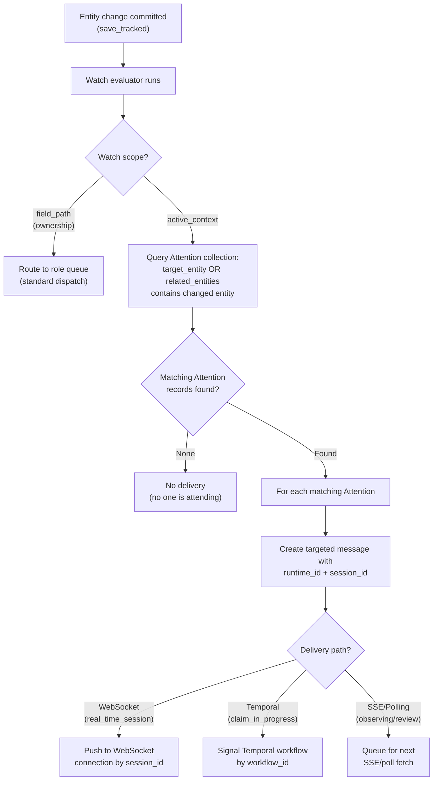

# Real-Time Architecture

This document describes how the Indemn OS delivers real-time events, manages active working context, and orchestrates voice and chat harness lifecycles. A senior developer who has never seen this system should understand how entities, attention, runtimes, and event delivery connect after reading this document.

---

## Attention Entity

Attention represents active working context -- who is attending to what, right now. It is the mechanism by which the system knows which actors care about which entities in real time, and routes events accordingly.

| Field | Type | Description |
|-------|------|-------------|
| `actor_id` | ObjectId | The attending actor (human or associate) |
| `target_entity` | object | `{entity_type: str, entity_id: ObjectId}` -- the entity being attended to |
| `related_entities` | list | Additional entities in the working context (e.g., the org, related submissions) |
| `purpose` | enum | `real_time_session`, `observing`, `review`, `editing`, `claim_in_progress` |
| `runtime_id` | ObjectId | For associates: which Runtime instance is handling this |
| `workflow_id` | string | Temporal workflow ID if processing via workflow |
| `session_id` | ObjectId | Auth Session associated with this attention |
| `opened_at` | datetime | When attention was opened |
| `last_heartbeat` | datetime | Last heartbeat received |
| `expires_at` | datetime | Hard TTL, computed as `last_heartbeat + 2 minutes` |

**State machine:**

```
active --> expired     (heartbeat TTL exceeded)
active --> closed      (explicit close by actor or harness)
```

### Heartbeat Protocol

Active Attention records must be heartbeated to stay alive. This prevents phantom attention from crashed clients or terminated harnesses.

- **Interval:** 30 seconds
- **TTL:** 2 minutes from last heartbeat
- **Cleanup:** Queue processor checks for expired Attention records every sweep cycle (5 seconds) and transitions them to `expired`

**Noise reduction:** Heartbeat updates bypass audit logging. Writing a change record every 30 seconds for every active session would dominate the changes collection with noise. Only three Attention events generate change records:

| Event | Generates Change Record |
|-------|------------------------|
| Attention opened | Yes |
| Heartbeat update | No (direct MongoDB update, no `save_tracked()`) |
| Attention closed | Yes |
| Attention expired (TTL) | Yes |

Implementation: `kernel_entities/attention.py` for the entity definition. `kernel/queue_processor.py::cleanup_expired_attentions()` for TTL enforcement.

### Purpose Types

| Purpose | Who Uses It | What It Means |
|---------|-------------|---------------|
| `real_time_session` | Chat/voice harnesses | Active conversation with a customer or user |
| `observing` | Human supervisors, dashboards | Watching but not handling -- receives events without claiming |
| `review` | Human review workflow | Actor is reviewing an entity for a decision |
| `editing` | UI sessions | Actor has an entity open for editing |
| `claim_in_progress` | Temporal workflow | Associate has claimed a message and is processing |

---

## Runtime Entity

Runtime represents an execution environment for associates -- a deployed harness capable of processing messages for a specific kind and framework combination.

| Field | Type | Description |
|-------|------|-------------|
| `name` | string | Human-readable name (e.g., "Chat DeepAgents Production") |
| `kind` | enum | `realtime_chat`, `realtime_voice`, `realtime_sms`, `async_worker` |
| `framework` | string | Execution framework (e.g., "deepagents", "langgraph") |
| `transport` | object | Connection configuration (WebSocket URL, Temporal task queue, etc.) |
| `llm_config` | object | Default LLM configuration for associates on this runtime |
| `deployment_image` | string | Docker image reference |
| `deployment_platform` | string | Where this runtime runs (e.g., "railway", "ec2") |
| `capacity` | object | `{max_concurrent: int, current: int}` |
| `status` | enum | See state machine below |
| `instances` | list | Active instances with health metadata |

**State machine:**

```
configured --> deploying --> active --> draining --> stopped
                              |                       ^
                              +-----> error -----------+
```

| State | Meaning |
|-------|---------|
| `configured` | Runtime definition exists but no instances deployed |
| `deploying` | Infrastructure provisioning in progress |
| `active` | Accepting and processing work |
| `draining` | No new work accepted, existing work completing |
| `stopped` | Fully shut down |
| `error` | Deployment or runtime failure, requires intervention |

Implementation: `kernel_entities/runtime.py`.

---

## Scoped Watches and Real-Time Event Delivery

The standard watch system (described in `overview.md`) routes entity changes to roles. Scoped watches extend this for real-time delivery by querying Attention records to determine which specific actors should receive an event, and using the `runtime_id` and `session_id` on those records for in-process delivery.

### The active_context Scope

Watches can define their scope as `active_context`. When a watch with this scope evaluates:

1. The entity change is detected (normal watch evaluation in `save_tracked()`)
2. Instead of creating a message for a role's queue, the system queries Attention records
3. The query: "Which actors have an Attention record whose `target_entity` or `related_entities` includes the changed entity?"
4. For each matching Attention, a targeted message is created with the Attention's `runtime_id` and `session_id`
5. The harness or client holding that session receives the event in-process

This is how a voice harness receives real-time updates to entities it is working on, without polling.



Implementation: `kernel/watch/scope.py::resolve_scope()` handles both `field_path` and `active_context` scope types. `kernel/message/emit.py::evaluate_watches_and_emit()` uses the scope resolver to determine message targets.

---

## The `indemn events stream` Command

One CLI primitive provides real-time event access: a long-running subprocess that connects to MongoDB Change Streams and emits JSON lines on stdout.

```bash
# Stream all entity changes in the current org
indemn events stream

# Stream changes for a specific entity type
indemn events stream --entity-type Submission

# Stream changes for a specific entity
indemn events stream --entity-type Submission --entity-id sub_abc123

# Stream with filters
indemn events stream --entity-type Interaction --filter '{"status": "active"}'
```

Output format (one JSON object per line):

```json
{"event": "entity_changed", "entity_type": "Submission", "entity_id": "sub_abc123", "changed_fields": ["status"], "old_values": {"status": "new"}, "new_values": {"status": "classified"}, "changed_by": "actor_xyz", "correlation_id": "trace_123", "timestamp": "2026-04-22T14:30:00Z"}
```

**How it works:**

1. CLI opens a WebSocket connection to the API server's `/events/stream` endpoint
2. API server opens a MongoDB Change Stream with the specified filters, scoped to the current org
3. Change Stream events are translated to the JSON line format and pushed to the WebSocket
4. CLI prints each line to stdout
5. On disconnect, CLI reconnects with a resume token to avoid missing events

**Why stdout:** Harnesses consume events by reading stdout of a subprocess. This keeps the harness simple -- no WebSocket client library needed, no reconnection logic (the CLI handles it), and events arrive as lines that can be parsed by any language.

Implementation: `kernel/api/events.py` for the WebSocket endpoint. `kernel/cli/events_commands.py` for the CLI command.

---

## Harness Lifecycle: Voice Example

The voice harness lifecycle demonstrates how Attention, Runtime, event streaming, and the kernel entity system work together during a real-time conversation.

```
1. Receive call (voice provider webhook)
   |
2. Load config (Associate actor + skills + Integration)
   |
3. Create Interaction entity (status: active, channel: voice)
   |
4. Open Attention (purpose: real_time_session, runtime_id, session_id)
   |
5. Build agent (framework-specific, from skills + llm_config)
   |
6. Start events stream (indemn events stream --entity-type ... subprocess)
   |
7. Main loop:
   |   - Process voice frames (framework)
   |   - Pump events from stream subprocess (entity changes)
   |   - Send heartbeats every 30s (Attention TTL refresh)
   |   - Handle tool calls (indemn CLI subprocess)
   |
8. Call ends:
   |   - Close Attention
   |   - Transition Interaction to closed
   |   - Kill events stream subprocess
   |   - Clean up agent resources
```

**Step 3 -- Interaction creation:** The Interaction entity (a domain entity defined per customer) represents a conversation session. Creating it triggers watches that may notify supervisors, log the interaction, or update dashboards.

**Step 4 -- Attention opening:** The harness opens an Attention record with `purpose=real_time_session`. This registers the harness as actively working on the Interaction. Any entity changes related to this Interaction (or its related entities) will be routed to this harness via the scoped watch mechanism.

**Step 6 -- Events stream:** The harness starts `indemn events stream` as a subprocess. This gives the harness a feed of entity changes relevant to its working context. For example, if a supervisor updates the Interaction's metadata while the call is active, the harness receives the change in real time.

**Step 7 -- Tool calls:** When the AI associate needs to create or update entities (e.g., create a Submission, update an Interaction field), it does so via CLI subprocess (`indemn submission create --data '{...}'`). These CLI calls go through the API server, through auth, through `save_tracked()`, and may trigger further watches.

---

## Handoff

Handoff transfers an active interaction from one actor to another. It is implemented as an entity field change, not a separate mechanism.

### Transfer to Specific Actor

```bash
indemn interaction update <id> --data '{"handling_actor_id": "actor_human_123"}'
```

The Interaction entity has `handling_actor_id` and `handling_role_id` fields. Changing `handling_actor_id`:
- The current handler's Attention expires (harness detects via events stream, gracefully closes)
- A message is created for the new handler via watch evaluation
- If the new handler is an associate, the Runtime picks it up via Temporal workflow
- If the new handler is a human, a notification is delivered via their active sessions

### Transfer to Role

```bash
indemn interaction update <id> --data '{"handling_role_id": "role_support_team"}'
```

Changing `handling_role_id` without specifying `handling_actor_id`:
- The interaction goes to the role's queue
- Any actor with that role can claim it
- First claim wins (optimistic concurrency via visibility timeout)

### Human Involvement States

From the system's perspective, a human's relationship to an active interaction has three states:

| State | Attention Purpose | Receives Events | Can Act |
|-------|------------------|-----------------|---------|
| **Not involved** | No Attention record | No | No (unless they claim it) |
| **Observing** | `observing` | Yes (read-only feed) | No (can escalate or claim) |
| **Handling** | `real_time_session` or `review` | Yes (full feed) | Yes |

Transitions between states are Attention lifecycle operations:

```bash
# Start observing
indemn attention create --target-entity '{"entity_type": "Interaction", "entity_id": "int_123"}' --purpose observing

# Upgrade to handling
indemn attention update <attention_id> --data '{"purpose": "real_time_session"}'

# Stop involvement
indemn attention close <attention_id>
```

---

## Voice Clients for Humans

When a human takes over a voice interaction, they need a voice client. This is represented as an Integration entity with `system_type=voice_client`.

The Integration's adapter connects the human to the voice session through the configured provider (e.g., Twilio, LiveKit). The handoff flow:

1. Human claims the interaction (`handling_actor_id` change)
2. System resolves the human's voice_client Integration
3. Adapter initiates a call to the human (or connects them to the existing session)
4. Human's Attention is created with `purpose=real_time_session`

---

## Three-Layer Config

Real-time associate behavior is configured across three layers that merge at invocation time.

| Layer | Where It Lives | What It Configures | Who Sets It |
|-------|---------------|-------------------|-------------|
| **Transport (Deployment)** | Runtime entity | WebSocket URLs, timeouts, reconnection policy, TLS settings | Platform/DevOps |
| **Conversation (Associate skill)** | Skill documents on Actor entity | System prompt, tools, persona, conversation flow, guardrails | Domain builder |
| **Execution (Runtime)** | Runtime entity | LLM provider, model, temperature, max tokens, retry policy | Platform/DevOps |

**Merge order:** Runtime defaults (base) --> Associate config (overrides) --> Deployment config (overrides).

This means an associate's skill can specify `llm_config.model = "claude-sonnet-4-20250514"` which overrides the Runtime's default of `claude-sonnet-4-20250514`. But the Deployment can override both with a specific model if needed (e.g., during an incident where a provider is down).

```bash
# View effective config for an associate on a runtime
indemn actor effective-config <actor_id> --runtime <runtime_id>
```

The effective config is computed at invocation time, not stored. This means changes to any layer take effect immediately for new invocations without redeploying harnesses.

Implementation: `kernel/temporal/activities.py::load_actor()` performs the three-layer merge when preparing an associate for execution.
