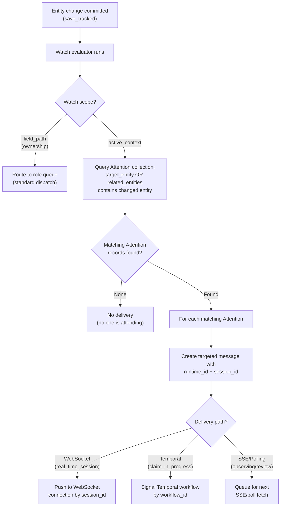

# Real-Time Architecture

This document describes how the Indemn OS delivers real-time events, manages active working context, and orchestrates voice and chat harness lifecycles. A senior developer who has never seen this system should understand how entities, attention, runtimes, and event delivery connect after reading this document.

---

## Attention Entity

Attention represents active working context -- who is attending to what, right now. It is the mechanism by which the system knows which actors care about which entities in real time, and routes events accordingly.

| Field | Type | Description |
|-------|------|-------------|
| `actor_id` | ObjectId | The attending actor (human or associate) |
| `target_entity` | object | `{entity_type: str, entity_id: ObjectId}` -- the entity being attended to |
| `related_entities` | list | Additional entities in the working context (e.g., the org, related submissions) |
| `purpose` | enum | `real_time_session`, `observing`, `review`, `editing`, `claim_in_progress` |
| `runtime_id` | ObjectId | For associates: which Runtime instance is handling this |
| `workflow_id` | string | Temporal workflow ID if processing via workflow |
| `session_id` | ObjectId | Auth Session associated with this attention |
| `opened_at` | datetime | When attention was opened |
| `last_heartbeat` | datetime | Last heartbeat received |
| `expires_at` | datetime | Hard TTL, computed as `last_heartbeat + 2 minutes` |

**State machine:**

```
active --> expired     (heartbeat TTL exceeded)
active --> closed      (explicit close by actor or harness)
```

### Heartbeat Protocol

Active Attention records must be heartbeated to stay alive. This prevents phantom attention from crashed clients or terminated harnesses.

- **Interval:** 30 seconds
- **TTL:** 2 minutes from last heartbeat
- **Cleanup:** Queue processor checks for expired Attention records every sweep cycle (5 seconds) and transitions them to `expired`

**Noise reduction:** Heartbeat updates bypass audit logging. Writing a change record every 30 seconds for every active session would dominate the changes collection with noise. Only three Attention events generate change records:

| Event | Generates Change Record |
|-------|------------------------|
| Attention opened | Yes |
| Heartbeat update | No (direct MongoDB update, no `save_tracked()`) |
| Attention closed | Yes |
| Attention expired (TTL) | Yes |

Implementation: `kernel_entities/attention.py` for the entity definition. `kernel/queue_processor.py::cleanup_expired_attentions()` for TTL enforcement.

### Purpose Types

| Purpose | Who Uses It | What It Means |
|---------|-------------|---------------|
| `real_time_session` | Chat/voice harnesses | Active conversation with a customer or user |
| `observing` | Human supervisors, dashboards | Watching but not handling -- receives events without claiming |
| `review` | Human review workflow | Actor is reviewing an entity for a decision |
| `editing` | UI sessions | Actor has an entity open for editing |
| `claim_in_progress` | Temporal workflow | Associate has claimed a message and is processing |

---

## Runtime Entity

Runtime represents an execution environment for associates -- a deployed harness capable of processing messages for a specific kind and framework combination.

| Field | Type | Description |
|-------|------|-------------|
| `name` | string | Human-readable name (e.g., "Chat DeepAgents Production") |
| `kind` | enum | `realtime_chat`, `realtime_voice`, `realtime_sms`, `async_worker` |
| `framework` | string | Execution framework (e.g., "deepagents", "langgraph") |
| `transport` | object | Connection configuration (WebSocket URL, Temporal task queue, etc.) |
| `llm_config` | object | Default LLM configuration for associates on this runtime |
| `deployment_image` | string | Docker image reference |
| `deployment_platform` | string | Where this runtime runs (e.g., "railway", "ec2") |
| `capacity` | object | `{max_concurrent: int, current: int}` |
| `status` | enum | See state machine below |
| `instances` | list | Active instances with health metadata |

**State machine:**

```
configured --> deploying --> active --> draining --> stopped
                              |                       ^
                              +-----> error -----------+
```

| State | Meaning |
|-------|---------|
| `configured` | Runtime definition exists but no instances deployed |
| `deploying` | Infrastructure provisioning in progress |
| `active` | Accepting and processing work |
| `draining` | No new work accepted, existing work completing |
| `stopped` | Fully shut down |
| `error` | Deployment or runtime failure, requires intervention |

Implementation: `kernel_entities/runtime.py`.

---

## Deployment Entity

Deployment represents a specific placement of an associate on a specific surface, with surface-specific configuration. Where Runtime is "this harness is running and has capacity," Deployment is "this associate is exposed at this venue, with this config."

A Deployment is the bridge between an abstract associate (the Actor + skill that defines what the agent does) and a concrete venue where end-users encounter it (a customer's website, an internal team UI, a phone number). Same associate underneath, many Deployments — Branch's renewal page, GIC's portal, the internal sales team UI — each with different visual configuration, different initialization parameters, different greeting, optionally different LLM overrides.

| Field | Type | Description |
|-------|------|-------------|
| `name` | string | Human-readable identifier (e.g., "Sales Assistant — Web") |
| `associate_id` | ObjectId | The Actor (associate) being deployed |
| `runtime_id` | ObjectId | The Runtime serving this Deployment. The Runtime's `kind` determines the channel (chat/voice/etc.). Distinct from `Actor.runtime_id` (the associate's default async runtime). |
| `surface_config_id` | ObjectId (optional) | Reference to a SurfaceConfig — the vendor + visual configuration for this placement. Required for UI-having Deployments; omitted for non-surface placements (e.g., async fetcher Deployments). |
| `parameter_schema` | object | JSON Schema (draft 2020-12) describing what dynamic parameters the surface must/may pass at session start. Validated server-side at session start. |
| `static_parameters` | dict | Values baked into the Deployment, constant across sessions (e.g., `{"role": "sales", "tenant": "indemn-internal"}`) |
| `parameter_schema_validation_mode` | enum | `strict` (reject session on validation failure) or `forgiving` (open session with warnings). Default derived from `acts_as`. |
| `llm_override` | dict | Per-deployment overrides on the three-layer LLM config merge (Runtime → Associate → Deployment) |
| `greeting` | string | Opening text the harness speaks/sends at session start (e.g., "Hi, I'm your proposal assistant.") |
| `acts_as` | enum | `session_actor` (agent CLI calls run with the user's permissions via `INDEMN_EFFECTIVE_ACTOR_ID = dynamic_params.actor_id`) or `associate_self` (agent CLI calls run with the associate's own permissions). Default derived from whether `parameter_schema` requires `actor_id`. See `deployments.md` for the full security model. |
| `allowed_origins` | list[string] | CORS allowlist for the runtime's HTTP endpoint + WebSocket Origin header check. Empty list = reject all origins (must explicitly enumerate). |
| `resumption_config` | dict | `{ttl_seconds, kill_on_resume}` controlling reconnection behavior — how long a session is resumable + whether to force-close a prior worker on reconnect |
| `status` | enum | See state machine below |

**State machine:**

```
configured --> active --> paused --> active
                  |          |         |
                  +----------+---------+--> archived
                  |          |
                  +-> error -+
                     (recovery: error -> configured)
```

| State | Meaning |
|-------|---------|
| `configured` | Created but not yet accepting sessions. Use for staging / dry-run. |
| `active` | Accepting sessions. Runtime opens connections normally. |
| `paused` | Not accepting new sessions. Existing sessions continue to completion. Use during incident response or A/B test off-periods. |
| `error` | Health failure (Runtime in error, SurfaceConfig JSON Schema invalid, LiveKit instance unreachable, etc.). Sessions rejected. Recovery: investigate, transition back to `configured`. |
| `archived` | Permanently retired. The record stays for historical analytics (`Interaction.deployment_id` still resolves). |

**Required indexes:**
- `(org_id, name)` unique
- `(org_id, associate_id, status)` — "find all active Deployments of an associate"
- `(org_id, runtime_id, status)` — "find all active Deployments served by a runtime"
- `(org_id, status)`

**Relationship to other entities:**

```
Actor (associate) 1───* Deployment 1───1 Runtime
                                 │
                                 └──► SurfaceConfig 1───* BrandAssets
                                      (optional)
```

One associate → many Deployments (the "same agent, many venues" pattern). One Deployment → one Runtime (the channel boundary — Deployment binds to a specific channel via Runtime.kind). One Deployment → one SurfaceConfig optionally (only for UI-having placements). SurfaceConfigs may reference shared BrandAssets for reuse across many SurfaceConfigs.

**Granularity rule:** one Deployment is per `(associate, channel/transport)`. The same associate on web chat AND voice on the same page = two Deployment records (different runtimes; different SurfaceConfigs). Different associates on the same page = different Deployment records.

Implementation: `kernel_entities/deployment.py`. Full design + worked examples + security model: [`deployments.md`](deployments.md).

---

## Scoped Watches and Real-Time Event Delivery

The standard watch system (described in `overview.md`) routes entity changes to roles. Scoped watches extend this for real-time delivery by querying Attention records to determine which specific actors should receive an event, and using the `runtime_id` and `session_id` on those records for in-process delivery.

### The active_context Scope

Watches can define their scope as `active_context`. When a watch with this scope evaluates:

1. The entity change is detected (normal watch evaluation in `save_tracked()`)
2. Instead of creating a message for a role's queue, the system queries Attention records
3. The query: "Which actors have an Attention record whose `target_entity` or `related_entities` includes the changed entity?"
4. For each matching Attention, a targeted message is created with the Attention's `runtime_id` and `session_id`
5. The harness or client holding that session receives the event in-process

This is how a voice harness receives real-time updates to entities it is working on, without polling.



Implementation: `kernel/watch/scope.py::resolve_scope()` handles both `field_path` and `active_context` scope types. `kernel/message/emit.py::evaluate_watches_and_emit()` uses the scope resolver to determine message targets.

---

## The `indemn events stream` Command

One CLI primitive provides real-time event access: a long-running subprocess that connects to MongoDB Change Streams and emits JSON lines on stdout.

```bash
# Stream all entity changes in the current org
indemn events stream

# Stream changes for a specific entity type
indemn events stream --entity-type Submission

# Stream changes for a specific entity
indemn events stream --entity-type Submission --entity-id sub_abc123

# Stream with filters
indemn events stream --entity-type Interaction --filter '{"status": "active"}'
```

Output format (one JSON object per line):

```json
{"event": "entity_changed", "entity_type": "Submission", "entity_id": "sub_abc123", "changed_fields": ["status"], "old_values": {"status": "new"}, "new_values": {"status": "classified"}, "changed_by": "actor_xyz", "correlation_id": "trace_123", "timestamp": "2026-04-22T14:30:00Z"}
```

**How it works:**

1. CLI opens a WebSocket connection to the API server's `/events/stream` endpoint
2. API server opens a MongoDB Change Stream with the specified filters, scoped to the current org
3. Change Stream events are translated to the JSON line format and pushed to the WebSocket
4. CLI prints each line to stdout
5. On disconnect, CLI reconnects with a resume token to avoid missing events

**Why stdout:** Harnesses consume events by reading stdout of a subprocess. This keeps the harness simple -- no WebSocket client library needed, no reconnection logic (the CLI handles it), and events arrive as lines that can be parsed by any language.

Implementation: `kernel/api/events.py` for the WebSocket endpoint. `kernel/cli/events_commands.py` for the CLI command.

---

## Harness Lifecycle: Voice Example

The voice harness lifecycle demonstrates how Attention, Runtime, event streaming, and the kernel entity system work together during a real-time conversation.

```
1. Frontend calls runtime's HTTP frontdoor (POST /sessions) with
   {deployment_id, dynamic_params} + Authorization: Bearer <jwt>
   |
2. Runtime validates: Origin, JWT, Deployment.status=active,
   dynamic_params against parameter_schema (JSON Schema), acts_as
   matches authenticated actor (if session_actor)
   |
3. Create Interaction entity (status: active, channel: voice,
   deployment_id, correlation_id, created_by=<jwt-actor>)
   |
4. Mint LiveKit participant token; create LiveKit room with
   metadata={deployment_id, dynamic_params, interaction_id, correlation_id}
   |
5. AgentDispatch to worker fleet (LiveKit dispatches to a heartbeated worker)
   |
6. Worker entrypoint runs: reads room.metadata, sets INDEMN_SERVICE_TOKEN,
   INDEMN_EFFECTIVE_ACTOR_ID (per acts_as), INDEMN_CORRELATION_ID
   |
7. Worker loads Deployment + Associate + Runtime + SurfaceConfig + skill
   content (parallelized CLI calls)
   |
8. Worker composes <skill> + <deployment_context> SystemMessages;
   builds deepagents agent with MongoDBSaver checkpointer keyed by
   interaction_id (see observability.md § thread_id semantics)
   |
9. Open Attention (purpose: real_time_session, runtime_id, session_id)
   |
10. Start events stream (indemn events stream subprocess)
   |
11. Main loop:
   |   - Process voice frames (framework)
   |   - Drain events from stream subprocess on each user turn
   |   - Send heartbeats every 30s (Attention TTL refresh)
   |   - Handle tool calls (indemn CLI subprocess with INDEMN_EFFECTIVE_ACTOR_ID)
   |
12. Call ends:
   |   - Close Attention
   |   - Transition Interaction to closed (or keep open for resume per
   |     Deployment.resumption_config)
   |   - Kill events stream subprocess
   |   - Clean up agent resources
```

**Step 1 -- HTTP front door:** Each real-time runtime exposes its channel-native protocol on its own URL. Chat runtimes serve WebSocket directly (the WebSocket connect message IS the session-start). Voice runtimes serve an HTTP `POST /sessions` endpoint that mints LiveKit participant tokens + dispatches workers (because the browser can't safely talk to LiveKit directly). The frontend (or embed.js SDK) doesn't need to know which mechanism the runtime uses — it just calls `Indemn.deploy({deployment_id, params})` and the SDK routes to the right place based on the Deployment's `runtime.kind`.

**Step 3 -- Interaction creation:** Created **server-side** in the runtime's `/sessions` endpoint (before the worker is dispatched). The Interaction carries `deployment_id` (back-reference to the venue) + `correlation_id` (the lineage tracker — set once here, propagated downstream). This gives the surface a stable `interaction_id` it can correlate with logs/analytics from before the worker spins up.

**Step 4 -- LiveKit room metadata carries NO credentials.** Room metadata is visible to all room participants (per LiveKit protocol). Auth tokens stay in the Authorization header on the original `/sessions` request — they don't propagate via room.metadata. The worker authenticates back to the OS using its own `INDEMN_SERVICE_TOKEN` from container env.

**Step 6 -- Per-session env vars set on subprocess:**
- `INDEMN_SERVICE_TOKEN`: runtime's identity (from AWS Secrets)
- `INDEMN_EFFECTIVE_ACTOR_ID`: enforced per `Deployment.acts_as` (the user's actor_id if `session_actor`; the associate's actor_id if `associate_self`). Critical security gate — see `deployments.md` § Auth identity.
- `INDEMN_CORRELATION_ID`: set to the session's correlation_id so all downstream CLI subprocess calls + entity writes inherit lineage (this is what makes cascade visibility work cross-channel)

**Step 8 -- SystemMessage composition + checkpointer keying:** The harness pre-fetches the associate's skill content + composes a `<skill>` SystemMessage and a `<deployment_context>` SystemMessage (carrying the merged static_parameters + dynamic_params). Both prepended ONCE at session start, persisted via MongoDB checkpointer. The checkpointer's `thread_id` for real-time sessions is the `interaction_id` — state accumulates across turns within the session, and resumes correctly on reconnect. For async work, the checkpointer's `thread_id` is the `message_id` — per-invocation isolation (cascade agents don't see each other's history). See `observability.md` § thread_id semantics for the full rule.

**Step 9 -- Attention opening:** The harness opens an Attention record with `purpose=real_time_session`. This registers the harness as actively working on the Interaction. Any entity changes related to this Interaction (or its related entities) will be routed to this harness via the scoped watch mechanism.

**Step 10 -- Events stream:** The harness starts `indemn events stream` as a subprocess. This gives the harness a feed of entity changes relevant to its working context. For example, if a supervisor updates the Interaction's metadata while the call is active, the harness receives the change in real time and drains it into a SystemMessage on the next user turn.

**Step 11 -- Tool calls:** When the AI associate needs to create or update entities, it does so via CLI subprocess (`indemn submission create --data '{...}'`). These CLI calls inherit `INDEMN_EFFECTIVE_ACTOR_ID` (whose permissions are enforced) and `INDEMN_CORRELATION_ID` (which gets stamped on every entity write + propagated to downstream watches). The chain of work — the original session → entity writes → triggered cascade — appears as one LangSmith thread via shared correlation_id.

**Step 12 -- Resume vs close:** If the Deployment has a non-zero `resumption_config.ttl_seconds`, the Interaction stays open after disconnect. A reconnecting client's `/sessions` request with `resume_interaction_id` finds the Interaction, loads the MongoDB checkpointer state by interaction_id, and continues the conversation with full prior context. See `deployments.md` § Resumability for the full mechanism.

---

## Handoff

Handoff transfers an active interaction from one actor to another. It is implemented as an entity field change, not a separate mechanism.

### Transfer to Specific Actor

```bash
indemn interaction update <id> --data '{"handling_actor_id": "actor_human_123"}'
```

The Interaction entity has `handling_actor_id` and `handling_role_id` fields. Changing `handling_actor_id`:
- The current handler's Attention expires (harness detects via events stream, gracefully closes)
- A message is created for the new handler via watch evaluation
- If the new handler is an associate, the Runtime picks it up via Temporal workflow
- If the new handler is a human, a notification is delivered via their active sessions

### Transfer to Role

```bash
indemn interaction update <id> --data '{"handling_role_id": "role_support_team"}'
```

Changing `handling_role_id` without specifying `handling_actor_id`:
- The interaction goes to the role's queue
- Any actor with that role can claim it
- First claim wins (optimistic concurrency via visibility timeout)

### Human Involvement States

From the system's perspective, a human's relationship to an active interaction has three states:

| State | Attention Purpose | Receives Events | Can Act |
|-------|------------------|-----------------|---------|
| **Not involved** | No Attention record | No | No (unless they claim it) |
| **Observing** | `observing` | Yes (read-only feed) | No (can escalate or claim) |
| **Handling** | `real_time_session` or `review` | Yes (full feed) | Yes |

Transitions between states are Attention lifecycle operations:

```bash
# Start observing
indemn attention create --target-entity '{"entity_type": "Interaction", "entity_id": "int_123"}' --purpose observing

# Upgrade to handling
indemn attention update <attention_id> --data '{"purpose": "real_time_session"}'

# Stop involvement
indemn attention close <attention_id>
```

---

## Voice Clients for Humans

When a human takes over a voice interaction, they need a voice client. This is represented as an Integration entity with `system_type=voice_client`.

The Integration's adapter connects the human to the voice session through the configured provider (e.g., Twilio, LiveKit). The handoff flow:

1. Human claims the interaction (`handling_actor_id` change)
2. System resolves the human's voice_client Integration
3. Adapter initiates a call to the human (or connects them to the existing session)
4. Human's Attention is created with `purpose=real_time_session`

---

## Three-Layer Config

Real-time associate behavior is configured across three layers that merge at invocation time.

| Layer | Where It Lives | What It Configures | Who Sets It |
|-------|---------------|-------------------|-------------|
| **Execution (Runtime)** | Runtime entity | Default LLM provider, model, temperature, framework version, capacity | Platform/DevOps |
| **Conversation (Associate)** | Actor entity + skill documents | System prompt, tools, persona, conversation flow, guardrails, per-agent model override | Domain builder |
| **Transport (Deployment)** | Deployment entity | Surface-specific config — SurfaceConfig reference (vendor + visual), greeting, per-deployment LLM override, parameter contract, acts_as auth identity | Platform/DevOps |

**Merge order:** Runtime defaults (base) → Associate config (overrides) → Deployment config (overrides).

This means an associate's skill can specify `llm_config.model = "claude-sonnet-4-20250514"` which overrides the Runtime's default. The Deployment can override both with a specific model if needed (e.g., during an incident, or per-venue tuning).

```bash
# View effective config for an associate on a runtime
indemn actor effective-config <actor_id> --runtime <runtime_id>
```

The effective config is computed at invocation time, not stored. Changes to any layer take effect immediately for new invocations without redeploying harnesses.

Implementation: `kernel/temporal/activities.py::load_actor()` performs the three-layer merge when preparing an associate for execution. The harness's `session.py::_merge_llm_config(runtime, associate, deployment)` performs the same merge for real-time sessions.

> **See also:** [`deployments.md`](deployments.md) for the full Deployment entity design — fields, state machine, parameter contract, acts_as auth identity model, SurfaceConfig + BrandAssets relationships, and how the embed.js SDK loads it.
