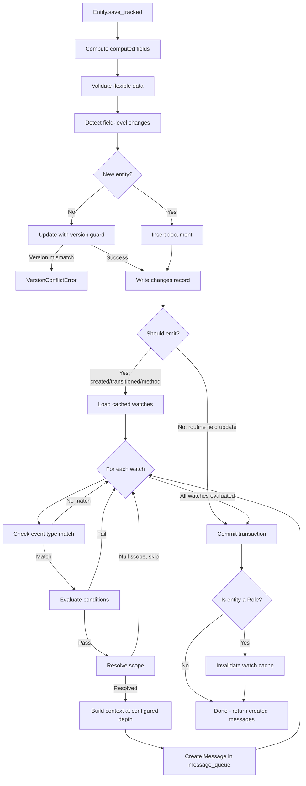
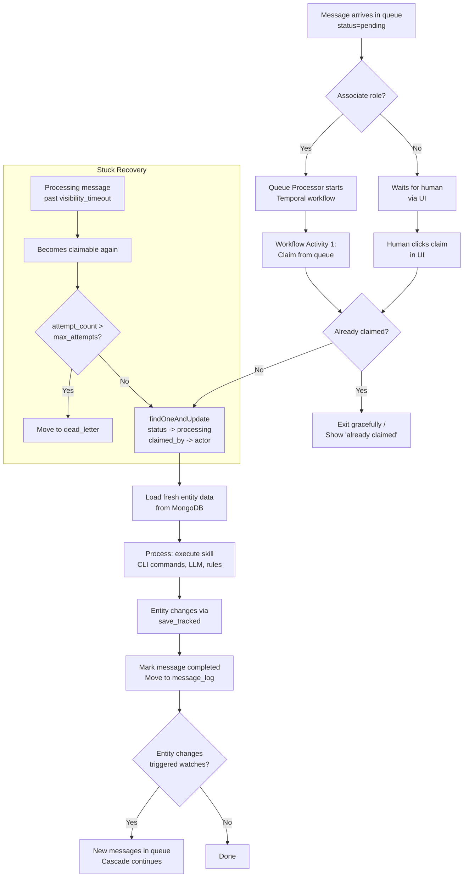

# Watches and Wiring

The nervous system of the OS. This document covers how entity changes become work for actors, and how the entire system behavior is declared, routed, observed, and debugged.

---

## 1. Watches -- The Wiring Mechanism

Watches live on Roles. A watch declares what entity changes matter to actors in that role.

A watch is: **entity type + event type + optional condition + optional scope**.

The design is actor-centric: the question is not "what happens when this entity changes" but **"what does this role care about?"** Every watch exists because an actor in that role needs to know about a specific kind of change. The entire behavior of a system is the set of watches across all roles -- visible via:

```bash
indemn role list --show-watches
```

This is the complete wiring diagram. There is no hidden routing, no event subscriptions, no configuration outside of role definitions. If a change doesn't match any watch, no message is created. If you want something to happen when an entity changes, you add a watch to a role.

Watch evaluation happens inside the `save_tracked()` transaction (see [Section 9](#9-the-save-transaction---where-it-all-happens) for the full flow). The kernel loads cached watches for the entity's org and type, evaluates each against the event, and creates messages for matches. All in the same MongoDB transaction as the entity write and the changes collection record.

---

## 2. Watch Events

Five event types. Every entity save produces at most one event (the "one save, one event" rule). The event carries metadata about what changed. Watches match against the event type and can refine further with conditions.

| Event | Fires When | Metadata |
|---|---|---|
| `created` | A new entity is inserted | (none -- the entity itself is new) |
| `transitioned` | A state machine transition occurred | `state_transition: {from, to}` |
| `method_invoked` | An `@exposed` method was called | `method: "classify"`, `fields_changed: [...]` |
| `fields_changed` | An `@exposed` method changed fields (synthetic -- fires alongside `method_invoked`) | `fields_changed: ["type", "confidence"]` |
| `deleted` | An entity is removed | (none -- the entity is gone) |

**Priority rule**: when a save involves both a state transition and a method invocation, the event type is `transitioned` (transition takes precedence). The method name is still available in `event_metadata.method` for watches that need it.

**Event matching logic** (`kernel/message/emit.py :: _event_matches`):

- `"created"` matches `created` events.
- `"transitioned"` matches any state transition. `"transitioned:active"` matches only transitions to the `active` state.
- `"method_invoked"` matches any exposed method call. `"method:classify"` matches only the `classify` method.
- `"fields_changed"` matches `method_invoked` events where `fields_changed` is non-empty. This provides a way to react to any field-level change without specifying the method.
- `"deleted"` matches entity deletion.

**Selective emission** prevents noise. Not every field change generates a message. Only three categories of save produce events:

1. Entity creation
2. State machine transitions
3. `@exposed` method invocations

An associate updating ten fields during processing does not generate ten messages. The save at the end generates one event capturing everything that changed.

---

## 3. Condition Language

One condition evaluator. One syntax. One debugging surface.

Shared by watches AND rules. The evaluator lives at `kernel/watch/evaluator.py` and is used by the watch evaluation path and the rule evaluation path identically.

### Operators

| Operator | Description | Example |
|---|---|---|
| `equals` | Exact match | `{"field": "status", "op": "equals", "value": "active"}` |
| `not_equals` | Not equal | `{"field": "type", "op": "not_equals", "value": "internal"}` |
| `contains` | Substring match (string) | `{"field": "subject", "op": "contains", "value": "Quote"}` |
| `not_contains` | Substring not present | `{"field": "subject", "op": "not_contains", "value": "SPAM"}` |
| `starts_with` | String prefix | `{"field": "from", "op": "starts_with", "value": "agent@"}` |
| `ends_with` | String suffix | `{"field": "from", "op": "ends_with", "value": "@usli.com"}` |
| `gt` | Greater than | `{"field": "confidence", "op": "gt", "value": 0.8}` |
| `gte` | Greater than or equal | `{"field": "priority", "op": "gte", "value": 3}` |
| `lt` | Less than | `{"field": "score", "op": "lt", "value": 50}` |
| `lte` | Less than or equal | `{"field": "attempts", "op": "lte", "value": 3}` |
| `in` | Value in list | `{"field": "stage", "op": "in", "value": ["verbal", "signed"]}` |
| `not_in` | Value not in list | `{"field": "type", "op": "not_in", "value": ["test", "draft"]}` |
| `matches` | Regex match | `{"field": "subject", "op": "matches", "value": "^RE:.*Quote"}` |
| `exists` | Field is non-null | `{"field": "assigned_to", "op": "exists", "value": true}` |
| `older_than` | Datetime older than duration | `{"field": "last_activity", "op": "older_than", "value": "7d"}` |
| `within` | Datetime within duration | `{"field": "created_at", "op": "within", "value": "24h"}` |

Duration strings for `older_than` and `within`: `"30s"`, `"15m"`, `"24h"`, `"7d"`.

### Logical Composition

```json
{"all": [condition, condition, ...]}
{"any": [condition, condition, ...]}
{"not": condition}
```

Nesting is supported to arbitrary depth:

```json
{
  "all": [
    {"field": "from_address", "op": "ends_with", "value": "@usli.com"},
    {"not": {"field": "subject", "op": "contains", "value": "Decline"}},
    {"any": [
      {"field": "type", "op": "equals", "value": "quote"},
      {"field": "type", "op": "equals", "value": "endorsement"}
    ]}
  ]
}
```

### Format: JSON Only

Craig's explicit decision. No CLI shorthand. One format everywhere -- the stored format and the CLI format are always JSON. The stored representation, the CLI input, the trace output, and the debug display all use the same JSON. This eliminates parsing ambiguity and makes conditions portable between watches and rules without translation.

For readability, complex conditions go in YAML files:

```bash
indemn rule create --from-file rules/usli-classification.yaml
```

But the stored format is JSON. The YAML is a convenience for authoring; it gets parsed to JSON before storage.

### Entity-Local Constraint

Watch conditions can only reference fields on the entity that changed. No cross-entity lookups during the save transaction. This is a non-negotiable design constraint that keeps watch evaluation fast and predictable.

The evaluator receives the entity's own field data (merged with event metadata for method/transition info). It does not have access to related entities during evaluation.

If you need to route based on a related entity's state, you have two options:

1. **Denormalize the field** onto the entity that changes (preferred for frequently-used routing fields).
2. **Evaluate after claiming** -- the actor loads related entities when processing the message and makes the decision in the skill.

The condition evaluator supports dot notation for nested fields within the entity's own data (e.g., `"field": "classification.type"`), but this traverses nested dictionaries, not entity relationships.

---

## 4. Watch Scoping

Sometimes a watch should target a specific actor, not everyone in the role. Scoping solves this. Scope is resolved at emit time -- the kernel writes `target_actor_id` on the message when it's created. No runtime scope evaluation when claiming.

Two resolution types, implemented in `kernel/watch/scope.py`:

### Type 1: `field_path` -- Ownership-Style Scoping

Traverses entity relationships to resolve an actor_id. "Only the owner gets the message."

```json
{
  "entity_type": "Meeting",
  "event": "created",
  "scope": {
    "type": "field_path",
    "path": "company.owner_id"
  }
}
```

When a Meeting:created event fires:
1. The kernel loads the Meeting entity.
2. Follows `meeting.company_id` to load the Company entity (the _id suffix is implicit -- `"company"` resolves to `company_id`).
3. Reads `company.owner_id` -- returns the actor ObjectId.
4. Writes the message with `target_actor_id` set to that actor.
5. Only that actor sees this message in their queue.

If the field path resolves to null (unowned entity), the scoped watch skips this event entirely. Unscoped watches for the same event still fire normally.

### Type 2: `active_context` -- Real-Time Routing

Queries Attention records for actors whose active working context includes this entity. "Only the associate currently handling this conversation gets the event."

```json
{
  "entity_type": "Payment",
  "event": "transitioned",
  "conditions": {"field": "state_transition.to", "op": "equals", "value": "completed"},
  "scope": {
    "type": "active_context",
    "traverses": "application_id"
  }
}
```

When a Payment:transitioned event fires:
1. The kernel reads `payment.application_id`.
2. Queries the Attention collection for active records where `target_entity.id` or `related_entities.id` matches that application ID, and `status` is `"active"` and `expires_at` is in the future.
3. For each matching Attention, creates a message with `target_actor_id` set to that Attention's actor.
4. If the Attention has a `runtime_id` and `session_id`, the kernel also notifies the Runtime for in-process delivery.

If no Attentions match, no scoped message is created.

### Unified Claim Semantics

Messages with `target_actor_id` set are claimable only by that actor. The claim query is:

```json
{
  "org_id": "<current_org>",
  "target_role": "<actor.role>",
  "status": "pending",
  "$or": [
    {"target_actor_id": null},
    {"target_actor_id": "<actor.id>"}
  ]
}
```

All scope resolution happens at emit time. At claim time, it's just an indexed field comparison.

### Performance

- **field_path**: 1-2 extra indexed reads per matching event (traversing entity relationships). Sub-millisecond with indexing.
- **active_context**: 1 indexed query on the Attention collection per matching event. The Attention collection is small (only active sessions, typically tens to low thousands of rows). Sub-millisecond.
- **Total overhead at 100K events/hour**: negligible.

---

## 5. Watch Cache

Rules and watches are cached in memory with a 60-second TTL. Implementation: `kernel/watch/cache.py`.

```
Cache key: (org_id, entity_type) -> list of {watch, role_name}
```

**How it works:**

1. At startup, all watches from all Role entities are loaded into a flat dictionary keyed by `(org_id, entity_type)`.
2. On each `save_tracked()` call, `get_cached_watches()` checks the TTL. If expired, it schedules an async reload. The current call uses the stale cache (acceptable -- 60 seconds is the maximum staleness).
3. When a Role entity is saved through `save_tracked()`, the cache is immediately invalidated and reloaded. This is the bootstrap entity cache invalidation mechanism -- configuration changes take effect immediately, not after up to 60 seconds.

**Bootstrap cascade guard**: when a Role entity save triggers watch evaluation, the kernel blocks self-referencing cascades at depth 1. A watch on `Role:modified` can fire (useful for admin notifications), but if the resulting actor tries to modify another Role, the cascade is blocked. This prevents infinite loops from meta-circular watch configurations. The save succeeds but no further messages are emitted for the self-referencing cascade.

**Multi-instance deployment**: each API/worker instance maintains its own cache with the 60-second TTL. Stronger consistency via MongoDB Change Stream on the roles collection is available as a future optimization but not required at current scale.

**Overhead**: sub-millisecond per evaluation. The cache is a dictionary lookup followed by condition evaluation (field comparisons, no I/O).

---

## 6. Watch Creation CLI

Watches are defined on roles. You create them when defining a role, or add them to an existing role.

### Creating a role with watches

```bash
indemn role create --data '{
  "name": "email_classifier",
  "permissions": {"read": ["Email", "Submission"], "write": ["Email"]},
  "watches": [{
    "entity_type": "Email",
    "event": "created",
    "conditions": {"field": "status", "op": "equals", "value": "received"}
  }]
}'
```

### Adding a watch to an existing role

```bash
indemn role add-watch underwriter --entity Assessment --on created \
  --when '{"field": "needs_review", "op": "equals", "value": true}'
```

### Adding a scoped watch

```bash
indemn role add-watch account_owner --entity Meeting --on created \
  --scope '{"type": "field_path", "path": "company.owner_id"}'
```

### Adding a watch with scope and conditions

```bash
indemn role add-watch quote_assistant --entity Payment --on transitioned \
  --when '{"field": "state_transition.to", "op": "equals", "value": "completed"}' \
  --scope '{"type": "active_context", "traverses": "application_id"}'
```

### Removing a watch

```bash
indemn role remove-watch underwriter --entity Assessment --on created
```

### Viewing all watches

```bash
indemn role list --show-watches
indemn role get underwriter --show-watches
```

---

## 7. The Message Queue

A single MongoDB collection: `message_queue`. This is the universal work inbox for humans and associates alike. The schema is defined in `kernel/message/schema.py`.

### Document Schema

| Field | Type | Description |
|---|---|---|
| `org_id` | ObjectId | Organization scope |
| `entity_type` | string | The entity type that changed (e.g., `"Email"`) |
| `entity_id` | ObjectId | The specific entity that changed |
| `event_type` | string | `created`, `transitioned`, `method_invoked`, `fields_changed`, `deleted` |
| `target_role` | string | Which role should process this |
| `target_actor_id` | ObjectId (nullable) | Specific actor target (from scoped watches), null = anyone in role |
| `status` | string | `pending` / `processing` / `completed` / `failed` / `dead_letter` / `circuit_broken` |
| `claimed_by` | ObjectId (nullable) | Actor who claimed this message |
| `claimed_at` | datetime (nullable) | When it was claimed |
| `visibility_timeout` | datetime (nullable) | When a processing message becomes re-claimable |
| `attempt_count` | int | How many times this has been claimed |
| `max_attempts` | int | Dead-letter threshold (default: 3) |
| `priority` | string | `critical` / `high` / `normal` / `low` |
| `created_at` | datetime | When the message was created |
| `due_by` | datetime (nullable) | Escalation deadline |
| `correlation_id` | string | = OTEL trace ID. Chains the entire cascade. |
| `causation_id` | string (nullable) | The message that directly caused this one |
| `depth` | int | Cascade depth (circuit breaker at 10) |
| `event_metadata` | dict | What changed: method name, state transition, fields changed |
| `context` | dict | Enriched entity data (depth-configurable) |
| `summary` | dict | Minimal data for queue list display |
| `last_error` | string (nullable) | Last processing error (for debugging failed messages) |

### Indexes

```
(org_id, target_role, status, priority DESC, created_at)  -- primary claim query
(status, visibility_timeout)                                -- stuck message recovery
(correlation_id, created_at)                                -- cascade debugging
```

### Split Storage

- **`message_queue`**: hot queue. Only active messages (pending, processing). Fast, small, indexed for claim queries.
- **`message_log`**: cold storage. Completed messages moved here. Retains everything for audit and analysis. Indexed for entity history and cascade replay.

The queue stays small and fast regardless of how much history accumulates.

### Messages Carry References, Not Copies

The entity in MongoDB is the source of truth. When an actor processes a message, it loads the current entity state -- fresh, authoritative, never stale. The `context` field provides just enough for queue display and initial routing without loading the full entity. The `entity_id` is the reference. One MongoDB read per message processing (3-10ms, negligible compared to LLM calls at 1-3 seconds).

---

## 8. The Unified Queue

One queue for everyone. Humans and associates see the same items, claim through the same mechanism, appear in the same history.

### Claim Mechanism

Both humans and associates claim via `findOneAndUpdate`:

```javascript
db.message_queue.findOneAndUpdate(
  {
    "org_id": current_org,
    "target_role": actor.role,
    "status": "pending",
    "$or": [
      {"target_actor_id": null},
      {"target_actor_id": actor_id}
    ]
  },
  {
    "$set": {
      "status": "processing",
      "claimed_by": actor_id,
      "claimed_at": now,
      "visibility_timeout": now + timeout_duration
    },
    "$inc": {"attempt_count": 1}
  },
  { "sort": {"priority": -1, "created_at": 1} }
)
```

Atomic. First to claim wins. If someone else already claimed it, the next actor gets the next message. No conflict, no wasted work.

### What Differs: Execution After Claiming

| | Human | Associate |
|---|---|---|
| **Sees queue via** | UI (`GET /api/queue?role=underwriter&status=pending`) | Temporal workflow |
| **Claims via** | UI action (calls API, which runs `findOneAndUpdate`) | Temporal workflow Activity 1 (same `findOneAndUpdate`) |
| **Processes via** | UI/CLI interactively | Skill execution (CLI commands, LLM if needed) |
| **Marks complete via** | UI action | Temporal workflow Activity 3 |

The only difference is execution mode. Everything else -- queue, claiming, visibility, history, audit -- is identical.

### What Makes Gradual Rollout Possible

Add an associate to a role alongside a human. Both see the same queue. The associate claims and processes what it can. The human handles what it cannot. Remove the human from the role when the associate is trusted.

```bash
# Week 1: human only
indemn actor add-role jc --role classifier

# Week 2: associate added alongside human
indemn associate create --name "Email Classifier" \
  --role classifier --skill email-classification

# Week 3: human removed
indemn actor remove-role jc --role classifier
```

No infrastructure change. No queue migration. No routing change. The only thing that changes is who has which role.

---

## 9. The Save Transaction -- Where It All Happens

The `save_tracked()` method in `kernel/entity/save.py` is the ONLY save path for all entities. In a single MongoDB transaction:



**Selective emission decides whether to evaluate watches at all:**

| Save Type | Event Type | Watches Evaluated? |
|---|---|---|
| New entity | `created` | Yes |
| State transition | `transitioned` | Yes |
| `@exposed` method invocation | `method_invoked` | Yes |
| Plain field update (no method, no transition) | (none) | No |

This is the "one save, one event" rule. A single save produces at most one event type. Transition takes precedence over method invocation. Plain field updates produce no events and no messages.

---

## 10. Message Cascade

Entity changes create messages. Actors process messages by making entity changes. Those changes create more messages. The system churns.

```mermaid
sequenceDiagram
    participant External as External Event
    participant Entity as Entity Framework
    participant Watch as Watch Evaluator
    participant Queue as message_queue
    participant Actor as Actor (Human or Associate)

    External->>Entity: Create/Update entity
    Entity->>Entity: save_tracked() transaction
    Entity->>Watch: Evaluate watches (cached)
    Watch->>Queue: Create messages for matches

    loop Cascade continues
        Actor->>Queue: Claim message (findOneAndUpdate)
        Actor->>Entity: Load fresh entity data
        Actor->>Actor: Process (CLI commands, LLM, rules)
        Actor->>Entity: Create/Update entities
        Entity->>Entity: save_tracked() transaction
        Entity->>Watch: Evaluate watches
        Watch->>Queue: Create more messages
    end

    Note over Queue: All messages share correlation_id<br/>Depth increments each level<br/>Circuit breaker at depth 10
```

### Correlation and Depth

Every message in a cascade shares the same `correlation_id` (which equals the OTEL trace ID). This chains the entire execution tree back to the originating change.

`depth` increments at each level. The originating message has depth 0. Messages generated by processing that message have depth 1. And so on. The circuit breaker fires at depth 10 (configurable via `MAX_CASCADE_DEPTH`):

```python
if depth > MAX_CASCADE_DEPTH:
    # Create a circuit_broken message for investigation
    # Do NOT generate further messages
    return []
```

`causation_id` points to the specific message that directly caused this one (parent pointer). Combined with `correlation_id` (root pointer), the full tree is reconstructable.

---

## 11. Claiming vs. Assignment

Two separate concepts that compose. The skill decides when to use each.

### Claiming: Transient, About the Message

`findOneAndUpdate` on `message_queue`. "I am processing this message right now." Released when processing completes (message moves to `completed`) or on timeout (message becomes re-claimable).

```bash
# Happens automatically when an actor picks up a message from the queue
```

### Assignment: Persistent, About the Entity

An entity field referencing an actor. "This entity belongs to this actor." Persists across messages, survives processing completion, is part of the entity's data.

```bash
indemn submission assign SUB-001 --underwriter jc
# Sets submission.underwriter = jc's actor_id
# Recorded in changes collection
# Future scoped watches reference this field
```

### The Skill Decides

- **Classification skill**: claims the message, classifies the email, moves on. No assignment -- the classifier does not "own" the email.
- **Underwriter review skill**: claims the message AND assigns the submission to the underwriter. Ownership is persistent for the submission's lifecycle.
- **Stale checker skill**: claims scheduled messages, checks staleness, creates notifications. No assignment -- it's a sweep, not ownership.

---

## 12. Visibility Timeout -- Stuck Recovery

When an actor claims a message, it gets a visibility timeout. If the actor crashes or fails to complete within that window, the message becomes claimable again.

**How it works:**

1. On claim, `visibility_timeout` is set to `now + configured_duration` (default: 5 minutes for associates, configurable per role).
2. The claim query includes timed-out messages:

```javascript
"$or": [
  {"status": "pending"},
  {"status": "processing", "visibility_timeout": {"$lt": now}}
]
```

3. `attempt_count` increments on each claim.
4. When `attempt_count > max_attempts` (default: 3), the message moves to `dead_letter` status for investigation.

**Dead-letter messages** are not lost. They remain in the queue with status `dead_letter`, queryable via `indemn queue stats` and the UI. An operator can inspect, fix the issue, and requeue.

**Idempotency requirement**: because visibility timeouts allow re-delivery, all message handlers MUST be idempotent. Check if the entity already moved past the expected state before processing. Check if the work was already done before doing it again.

---

## 13. Scheduled Work

Schedules create messages in the queue. Same path as watch-triggered work. One path for ALL work.

When a schedule fires:

```
Schedule fires
  -> Creates message in message_queue
     (event_type: "schedule_fired", target_role: "stale_checker")
  -> Queue Processor starts Temporal workflow
  -> Workflow claims from queue -> processes -> entity changes
  -> Entity changes fire watches -> more messages -> cascade continues
```

An associate can be BOTH message-triggered (via watches) and schedule-triggered (via cron). A human can also have scheduled work appear in their queue. Same model for everyone.

```bash
indemn associate create --name "Stale Checker" \
  --trigger "schedule:0 * * * *" --skill stale-detection
```

For synthetic scheduled messages (no entity change triggered them), the `entity_type` and `entity_id` fields may reference the scheduled task configuration or be empty. The key property: the work is visible in the queue regardless of how it was initiated.

---

## 14. Direct Invocation -- Real-Time

For latency-sensitive triggers where queue-based dispatch is too slow (voice calls, chat sessions).

The pattern: create a queue entry for visibility AND invoke the actor directly for execution.

```
Voice call arrives
  -> Interaction entity created
  -> save_tracked() fires watches -> message written to queue (same as everything)
  -> SIMULTANEOUSLY: associate invoked directly (no waiting for Temporal dispatch)
  -> Direct invocation claims the queue entry immediately (so nobody else picks it up)
  -> Call proceeds (associate handles the live interaction)
  -> When done, queue message marked complete
```

The queue entry exists for visibility and history. The execution bypasses the queue-to-Temporal dispatch path for latency. But the work IS in the queue.

Like a hospital ER: the patient is registered (queue entry), treated immediately (direct invocation) rather than waiting their turn.

Implementation: `kernel/api/direct_invoke.py`. The direct invocation claims the queue entry immediately upon creation, then invokes the associate's runtime directly.

---

## 15. Observability

Every message carries `correlation_id` = OTEL `trace_id`. This is the connective tissue linking entity changes, watch evaluations, message creation, actor processing, and LLM calls into a single trace.

### Three Data Stores, Three Purposes, One Trace ID

| Store | Records | Retention | Query Pattern |
|---|---|---|---|
| **Changes collection** | Field-level entity mutations (who, what, from, to, when) | Years (compliance) | By entity_id |
| **Message log** | Completed work items (what processed, by whom, result) | Months-years (operations) | By role, date, entity_type |
| **OTEL traces** | Full execution path (spans, timing, parameters, errors) | Days-weeks (debugging) | By trace_id, span attributes |

### CLI Commands

```bash
# Unified entity timeline: changes + messages + traces
indemn trace entity Email EMAIL-001

# Full cascade tree from originating change
indemn trace cascade <correlation_id>

# Queue health: pending/processing/dead-letter per role
indemn queue stats
```

### What Gets Traced (OTEL spans)

Every `save_tracked()` call creates a span (`entity.save_tracked`). Within that span:
- Watch evaluation: `watch.evaluate` span wrapping all watch checks
- Per-message creation: `message.create` span for each message emitted
- Condition evaluation results (which watches matched, which didn't)
- Scope resolution (which actor was targeted)

When an actor processes a message:
- Temporal workflow spans (automatic via TracingInterceptor)
- CLI command execution spans
- LLM calls spans (model, tokens, duration)

All nested under one trace, linked by `correlation_id`.

---

## 16. Queue Claim Flow



---

## 17. Design Decisions and Why

### Why watches on roles, not event subscriptions

Event subscription systems (pub/sub, webhooks, event buses) are system-centric: "when this event happens, call this handler." The OS is actor-centric: "this role cares about these changes." The entire system behavior is visible by listing roles and their watches. You never have to search for subscribers, trace event handlers, or wonder who is listening to what. `indemn role list --show-watches` is the complete wiring diagram.

### Why entity-local conditions

Conditions that reference related entities during the save transaction would require cross-collection reads inside a transaction. This makes saves slower, harder to predict, and harder to debug. The entity-local constraint keeps watch evaluation to in-memory field comparisons against cached watches -- microseconds, not milliseconds.

### Why JSON only for conditions

One format everywhere. The stored format in MongoDB, the CLI input, the trace output, and the debug display all use the same JSON representation. No translation layer, no parsing ambiguity, no "the CLI shorthand means this in JSON." Associates, humans, and the kernel all speak the same condition language.

### Why a unified queue

Associates are employees. They see the same work, claim through the same mechanism, and appear in the same history. Splitting queues by actor type creates two systems that need bridging when work moves between humans and associates. The unified queue makes gradual rollout a role assignment change, not an infrastructure change.

### Why no outbox

Eliminated during architecture ironing. The original design had a separate outbox collection between entity saves and message creation. The resolution: write directly to `message_queue` in the entity save transaction. One collection, one transaction, one source of truth. The outbox was an unnecessary indirection -- the message queue IS the durable record of pending work.

### Why split hot/cold storage

The `message_queue` collection contains only active messages (pending, processing). Completed messages move to `message_log`. This keeps the hot queue small and fast -- claim queries scan a small, well-indexed collection regardless of how many millions of messages have been processed historically. The cold log retains everything for audit, compliance, and cascade replay.

### Why one save, one event

A single entity save during an `@exposed` method may change five fields and transition state. Generating separate events per change would multiply messages, complicate watch evaluation, and make cascade tracking harder. One save produces one event with full metadata. Watches evaluate against the complete picture of what happened. Each matching watch produces one message. The event is the atomic unit.

### Why the circuit breaker

A misconfigured watch can create infinite cascades: entity A changes, triggers a message to role X, whose actor changes entity B, which triggers a message to role Y, whose actor changes entity A, and so on. The depth counter (inherited from parent messages) and the hard stop at depth 10 prevent runaway cascades. Circuit-broken messages are preserved for investigation with status `circuit_broken`.
